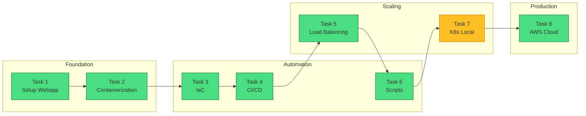
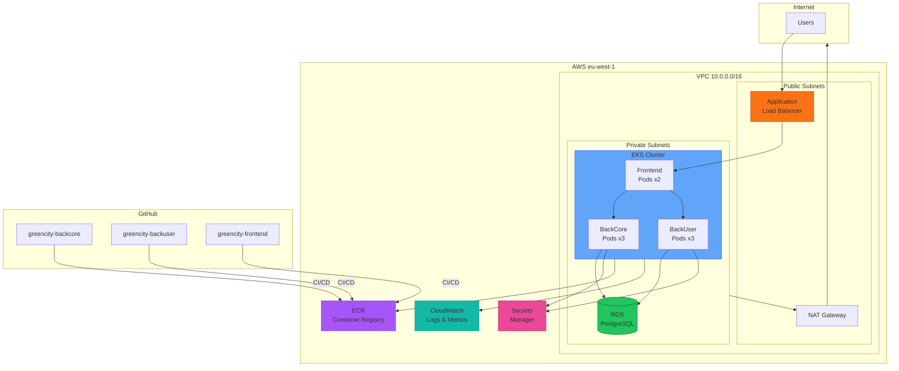

Greencity project
Project Overview
The main aim of “GreenCity” project is to teach people in a playful and challenging way to have an eco-friendly lifestyle. A user can view on the map places that have some eco-initiatives or suggest discounts for being environmentally aware (for instance, coffee shops that give a discount if a customer comes with their own cup). А user can start doing an environment-friendly habit and track their progress with a habit tracker.

There are three parts: backcore, backuser, and frontend

Key Features
Authentication and Registration: Users can create an account.

A user can start doing an environment-friendly habit and track their progress with a habit tracker.

## Repositories

| Repository | Purpose | URL |
|------------|---------|-----|
| **greencity-infra** | Infrastructure & DevOps | `git@github.com:1g0s/greencity-infra.git` |
| **greencity-backcore** | Java Backend Core API | `git@github.com:DevOps-ProjectLevel/greencity-backcore-1g0s.git` |
| **greencity-backuser** | Java Backend User API | `git@github.com:DevOps-ProjectLevel/greencity-backuser-1g0s.git` |
| **greencity-frontend** | Angular Frontend | `git@github.com:DevOps-ProjectLevel/greencity-frontend-1g0s.git` |

---

## Tasks

### Core Tasks (in order)
1. Setup a Webapp
2. Deploying a Containerized Web Application
3. Implement Infrastructure as Code (Vagrant + Ansible)
4. Implement a Continuous Integration/Continuous Delivery
5. Setup Load Balancing for Webapp
   - Deploy multiple backend instances (backcore and backuser)
   - Set up Nginx as a load balancer
   - Configure and test different load-balancing algorithms (round-robin, least_conn, ip_hash)
   - Implement health checks and failover
6. Implement Automatisation Setup a Webapp
7. Orchestration Web Application via k8s (optional - local learning)
8. Migrate an Application to the Cloud
9. Security & Vulnerability Scanning
   - Enable GitHub security features (Dependabot, Secret Scanning)
   - Implement container vulnerability scanning (Trivy)
   - Add static code analysis (CodeQL for Java)
   - Scan Terraform/IaC for misconfigurations

### Additional Tasks
- Set up monitoring tools for application performance and infrastructure health
- Configure logging mechanisms for tracking application and system logs
- Monitor resource usage and plan for scalability
- Implement CCI (Continuous Code Inspection)
- Artifact Management

---

## Implementation Plan

### Project Architecture Summary

| Component | Technology | Port |
|-----------|-----------|------|
| **greencity-backcore** | Java 21, Spring Boot 3.2.2, Maven | 8080 |
| **greencity-backuser** | Java 21, Spring Boot 3.2.2, Maven | 8060 |
| **greencity-frontend** | Angular 9.1.15, TypeScript, Node 14 | 80/4200 |
| **Database** | PostgreSQL | 5432 |
| **Storage** | Azure Blob / Google Cloud Storage | - |

### DevOps Journey



### Target AWS Architecture (Task 8)



### Infrastructure Repository Structure

```
greencity-infra/
├── .github/workflows/
│   └── docker.yml           # Docker build & push to ghcr.io
├── docker-compose.yml       # Development environment
├── docker-compose.prod.yml  # Production deployment (single instance)
├── docker-compose.lb.yml    # Load-balanced deployment (8 containers)
├── nginx/
│   └── nginx-lb.conf        # Nginx load balancer config
├── terraform/               # AWS infrastructure (Task 8)
│   ├── main.tf              # Provider, backend
│   ├── vpc.tf               # VPC, subnets, NAT
│   ├── eks.tf               # EKS cluster
│   ├── rds.tf               # PostgreSQL
│   ├── ecr.tf               # Container registry
│   └── ...                  # 12 files total
├── k8s/                     # Kubernetes manifests (Task 8)
│   ├── namespace.yaml
│   ├── configmap.yaml
│   ├── backcore/            # Deployment + Service
│   ├── backuser/            # Deployment + Service
│   ├── frontend/            # Deployment + Service
│   └── ingress.yaml         # ALB routing
├── scripts/                 # Automation scripts (Task 6 + 8)
│   ├── ops.sh               # Operations script
│   ├── deploy.sh            # AWS deployment
│   ├── destroy.sh           # AWS teardown
│   └── ...
├── .env.prod.example        # Environment template
├── epic.md                  # This file
├── README.md                # Quick start guide
└── tasks/                   # Task completion reports
    ├── task-01-setup-webapp.md
    ├── task-02-containerization.md
    ├── task-04-cicd.md
    ├── task-05-load-balancing.md
    └── task-08-cloud-migration.md
```

### Component Repos Include
- ✅ Frontend: GitHub Actions CI, Azure Pipelines CD, Helm chart
- ✅ Backend: Spring profiles for Docker/dev/prod
- ✅ Dockerfiles (all 3 repos)
- ✅ CI workflows (.github/workflows/ci.yml) for all 3 repos

---

### Task 1: Setup a Webapp

**Objective:** Get all three components running locally

**Steps:**
1. **Database Setup**
   - Deploy PostgreSQL (Docker or local)
   - Create database `greencity`
   - Run Liquibase migrations (auto on startup)

2. **Backend Core Service**
   ```bash
   cd greencity-backcore
   mvn clean package -DskipTests
   java -jar ./core/target/core.jar --spring.profiles.active=dev
   ```

3. **Backend User Service**
   ```bash
   cd greencity-backuser
   mvn clean package -DskipTests
   java -jar ./core/target/core.jar --spring.profiles.active=dev
   ```

4. **Frontend**
   ```bash
   cd greencity-frontend
   npm install
   ng serve --host 0.0.0.0
   ```

**Environment Variables Required:**
```bash
# Database
DATASOURCE_URL=jdbc:postgresql://localhost:5432/greencity
DATASOURCE_USER=postgres
DATASOURCE_PASSWORD=<password>

# Email (Gmail)
EMAIL_ADDRESS=<gmail>
EMAIL_PASSWORD=<app-password>

# Google APIs
GOOGLE_CLIENT_ID=<client-id>
GOOGLE_API_KEY=<api-key>
```

**Deliverables:**
- [x] Local development environment running
- [x] All services communicating
- [x] Database with initial data

**Status:** COMPLETED (January 6, 2026)

> **Full Report:** [tasks/task-01-setup-webapp.md](tasks/task-01-setup-webapp.md)

---

### Task 2: Deploying a Containerized Web Application

**Objective:** Containerize all services with production-ready Dockerfiles

**Deliverables:**
- [x] Dockerfile (backcore) - Multi-stage Maven/JRE build
- [x] Dockerfile (backuser) - Multi-stage Maven/JRE build
- [x] Dockerfile (frontend) - Multi-stage Angular/Nginx build
- [x] nginx.conf - API proxy, SPA routing, security headers
- [x] .dockerignore files - For all 3 repos
- [x] docker-compose.prod.yml - Production configuration
- [x] .env.prod.example - Environment template

**Status:** ✅ VERIFIED COMPLETE (January 11, 2026)

> **Full Report:** [tasks/task-02-containerization.md](tasks/task-02-containerization.md)

---

### Task 3: Infrastructure as Code (Vagrant + Ansible)

**Objective:** Provision clean VM infrastructure and deploy the load-balanced application using IaC tools

**Deployment:** VirtualBox VMs on z6, provisioned by Vagrant, configured by Ansible

**Architecture:**
```
z6 Host (192.168.1.115)
┌────────────────────────────────────────────────────────────────┐
│  VirtualBox                                                    │
│  ┌──────────────────────────────────────────────────────────┐  │
│  │  greencity-vm (Ubuntu 22.04)                             │  │
│  │  IP: 192.168.56.20                                       │  │
│  │  ┌────────────────────────────────────────────────────┐  │  │
│  │  │  Docker                                            │  │  │
│  │  │  ├── nginx (load balancer) :80                     │  │  │
│  │  │  ├── backcore1, backcore2, backcore3 :8080         │  │  │
│  │  │  ├── backuser1, backuser2, backuser3 :8060         │  │  │
│  │  │  └── postgres :5432                                │  │  │
│  │  └────────────────────────────────────────────────────┘  │  │
│  └──────────────────────────────────────────────────────────┘  │
└────────────────────────────────────────────────────────────────┘
```

**Requirements:**
- Vagrant 2.x with VirtualBox provider
- Ansible 2.9+ on z6 (control node)
- Clean Ubuntu 22.04 base box
- SSH key-based authentication

**Deliverables:**
- [ ] `vagrant/Vagrantfile` - VM definition (Ubuntu 22.04, 2 CPU, 8GB RAM)
- [ ] `ansible/inventory.yml` - Host definitions
- [ ] `ansible/playbook.yml` - Main deployment playbook
- [ ] `ansible/roles/docker/` - Install Docker and Docker Compose
- [ ] `ansible/roles/app/` - Deploy application stack
- [ ] `ansible/group_vars/` - Environment variables and secrets
- [ ] `README-iac.md` - Setup instructions

**Implementation Steps:**

1. **Create Vagrantfile**
   ```ruby
   Vagrant.configure("2") do |config|
     config.vm.box = "ubuntu/jammy64"
     config.vm.hostname = "greencity-vm"
     config.vm.network "private_network", ip: "192.168.56.20"
     config.vm.provider "virtualbox" do |vb|
       vb.memory = "8192"
       vb.cpus = 2
     end
     config.vm.provision "ansible" do |ansible|
       ansible.playbook = "../ansible/playbook.yml"
     end
   end
   ```

2. **Create Ansible Playbook**
   - Install Docker and Docker Compose
   - Copy docker-compose.lb.yml and nginx config
   - Pull images from ghcr.io
   - Start the application stack (8 containers)

3. **Verify Deployment**
   ```bash
   vagrant up
   curl http://192.168.56.20/api/core/actuator/health
   curl http://192.168.56.20/api/user/actuator/health
   ```

**Verification Commands:**
```bash
# Start VM and provision
cd vagrant && vagrant up

# SSH into VM
vagrant ssh

# Check application status
curl http://192.168.56.20/nginx-health
curl http://192.168.56.20/api/core/v3/api-docs
curl http://192.168.56.20/api/user/v3/api-docs

# Destroy and recreate (test reproducibility)
vagrant destroy -f && vagrant up
```

**Status:** ✅ COMPLETE (January 14, 2026)

> **Full Report:** [tasks/task-03-iac.md](tasks/task-03-iac.md)

---

### Task 4: CI/CD Pipeline

**Objective:** Implement automated CI/CD pipelines with GitHub Actions

**Deliverables:**
- [x] BackCore CI workflow - Maven build, JUnit tests, JaCoCo coverage
- [x] BackUser CI workflow - Maven build, JUnit tests, JaCoCo coverage
- [x] Frontend CI workflow - npm ci, lint, stylelint, build, test
- [x] Docker build workflow - Build & push all 3 images to ghcr.io
- [x] CHECKOUT_TOKEN secret - Cross-repo access for Docker builds
- [x] Code formatting fixes - All Java files pass formatter validation

**Container Images (ghcr.io):**
```
ghcr.io/1g0s/greencity-backcore:latest
ghcr.io/1g0s/greencity-backuser:latest
ghcr.io/1g0s/greencity-frontend:latest
```

**Note:** Frontend also has Azure Pipelines for AKS deployment (kept as-is)

**Status:** ✅ VERIFIED COMPLETE (January 12, 2026)

> **Full Report:** [tasks/task-04-cicd.md](tasks/task-04-cicd.md)

---

### Task 5: Load Balancing

**Objective:** Set up Nginx load balancer to distribute traffic across multiple backend instances

**Deployment:** Local Docker on z6 (192.168.1.115) - all containers on single host

**Architecture:**
```
z6 Host (192.168.1.115)
┌──────────────────────────────────────────────────────────────────────────┐
│  Docker Network: greencity-lb-net                                        │
│                                                                          │
│                      ┌─────────────────┐                                 │
│                      │   Nginx LB      │ ← Port 80 exposed to host       │
│                      │   (port 80)     │                                 │
│                      └────────┬────────┘                                 │
│                               │                                          │
│              ┌────────────────┴────────────────┐                         │
│              │                                 │                         │
│              ▼                                 ▼                         │
│     ┌────────────────┐                ┌────────────────┐                 │
│     │  /api/core/*   │                │  /api/user/*   │                 │
│     │ backcore_pool  │                │ backuser_pool  │                 │
│     └───────┬────────┘                └───────┬────────┘                 │
│             │                                 │                          │
│  ┌──────────┼──────────┐       ┌──────────────┼──────────────┐           │
│  │          │          │       │              │              │           │
│  ▼          ▼          ▼       ▼              ▼              ▼           │
│┌────────┐┌────────┐┌────────┐┌────────┐┌────────┐┌────────┐              │
││backcore││backcore││backcore││backuser││backuser││backuser│              │
││   1    ││   2    ││   3    ││   1    ││   2    ││   3    │              │
││ :8080  ││ :8080  ││ :8080  ││ :8060  ││ :8060  ││ :8060  │              │
│└───┬────┘└───┬────┘└───┬────┘└───┬────┘└───┬────┘└───┬────┘              │
│    │         │         │         │         │         │                   │
│    └─────────┴─────────┴─────────┴─────────┴─────────┘                   │
│                               │                                          │
│                               ▼                                          │
│                      ┌─────────────────┐                                 │
│                      │   PostgreSQL    │ ← Port 5432 (internal)          │
│                      │   (port 5432)   │                                 │
│                      └─────────────────┘                                 │
└──────────────────────────────────────────────────────────────────────────┘
```

**Requirements:**
- Nginx as reverse proxy and load balancer
- Multiple instances for both backcore (3) and backuser (3)
- Health checks with Spring Boot Actuator (`/actuator/health`)
- Session persistence option for stateful scenarios
- Separate upstream pools for each backend service

**Deliverables:**
- [x] `nginx/nginx-lb.conf` - Load balancer configuration with two upstreams
- [x] `docker-compose.lb.yml` - Multi-instance deployment (8 containers)
- [x] Health check endpoint verification (via X-Backend-Server header)
- [x] Load distribution tested with parallel requests
- [x] Failover tested and verified

**Load Balancing Algorithms to Test:**

| Algorithm | Use Case | Configuration |
|-----------|----------|---------------|
| Round Robin | Default, equal distribution | (default) |
| Least Connections | Uneven request processing times | `least_conn;` |
| IP Hash | Session persistence | `ip_hash;` |
| Weighted | Servers with different capacities | `server backcore1:8080 weight=3;` |

**Implementation Steps:**

1. **Create Load Balancer Config with Two Upstreams**
   ```nginx
   upstream backcore_servers {
       least_conn;
       server backcore1:8080 max_fails=3 fail_timeout=30s;
       server backcore2:8080 max_fails=3 fail_timeout=30s;
       server backcore3:8080 max_fails=3 fail_timeout=30s;
   }

   upstream backuser_servers {
       least_conn;
       server backuser1:8060 max_fails=3 fail_timeout=30s;
       server backuser2:8060 max_fails=3 fail_timeout=30s;
       server backuser3:8060 max_fails=3 fail_timeout=30s;
   }

   server {
       location /api/core/ {
           proxy_pass http://backcore_servers;
       }
       location /api/user/ {
           proxy_pass http://backuser_servers;
       }
   }
   ```

2. **Update Docker Compose for Multiple Instances**
   - Define explicit instances in docker-compose.lb.yml
   - Use Docker Compose `deploy.replicas` or separate service definitions

3. **Configure Spring Boot Actuator Health Checks**
   - Ensure `/actuator/health` endpoint is exposed
   - Configure Nginx to use health checks

4. **Test Each Algorithm**
   - Round Robin: Verify equal distribution
   - Least Connections: Simulate slow database queries
   - IP Hash: Verify session stickiness

**Verification Commands:**
```bash
# Test backcore load distribution
for i in {1..10}; do curl -s http://localhost/api/core/actuator/health | jq; done

# Test backuser load distribution
for i in {1..10}; do curl -s http://localhost/api/user/actuator/health | jq; done

# Check Nginx upstream status
docker exec nginx cat /var/log/nginx/access.log | tail -20

# Simulate backend failure
docker stop greencity-backcore-2
# Verify traffic redirects to healthy backends
```

**Status:** ✅ COMPLETE (January 12, 2026)

> **Full Report:** [tasks/task-05-load-balancing.md](tasks/task-05-load-balancing.md)

---

### Task 6: Automation

**Objective:** Create operations scripts for unified management of all deployment environments

**Deployment Environments:**
| Environment | Config File | Description |
|-------------|-------------|-------------|
| `prod` | docker-compose.prod.yml | Single instance production |
| `lb` | docker-compose.lb.yml | Load-balanced (3+3 backends) |
| `vm` | vagrant/Vagrantfile | Vagrant VM at 192.168.10.20 |

**Architecture:**
```
scripts/
├── ops.sh              # Main operations script
├── health-check.sh     # Health monitoring
├── backup.sh           # Database backup
└── restore.sh          # Database restore

ops.sh [command] [environment]
├── start   → Start services (prod|lb|vm)
├── stop    → Stop services
├── status  → Show container/service status
├── logs    → View service logs
├── health  → Run health checks
├── deploy  → Full deployment (pull + start)
├── restart → Restart services
└── cleanup → Remove stopped containers, images
```

**Deliverables:**
- [ ] `scripts/ops.sh` - Main operations script with subcommands
- [ ] `scripts/health-check.sh` - Automated health monitoring
- [ ] `scripts/backup.sh` - PostgreSQL backup script (pg_dump)
- [ ] `scripts/restore.sh` - PostgreSQL restore script
- [ ] Environment-aware operations (prod, lb, vm)
- [ ] Color-coded output with status indicators
- [ ] Error handling and validation

**ops.sh Commands:**

```bash
# Start services
./scripts/ops.sh start prod    # Single instance
./scripts/ops.sh start lb      # Load balanced (8 containers)
./scripts/ops.sh start vm      # Vagrant VM

# Stop services
./scripts/ops.sh stop lb

# View status
./scripts/ops.sh status lb

# View logs
./scripts/ops.sh logs backcore1

# Health check
./scripts/ops.sh health lb

# Full deployment
./scripts/ops.sh deploy lb

# Cleanup
./scripts/ops.sh cleanup
```

**Health Check Features:**
- Container status verification (all 8 containers)
- Endpoint accessibility:
  - Frontend: /
  - BackCore: /api/core/, /swagger-ui/
  - BackUser: /api/user/, /v3/api-docs
  - Nginx: /nginx-health, /nginx-status
- Response time measurement
- Load balancer distribution check (X-Backend-Server header)
- Automatic alerting on failures

**Backup/Restore Features:**
- PostgreSQL pg_dump to timestamped archives
- Restore from backup file
- Support for all environments
- Liquibase compatibility (restore triggers migrations)

**Verification Commands:**
```bash
# Test all operations
./scripts/ops.sh start lb
./scripts/ops.sh status lb
./scripts/ops.sh health lb
./scripts/ops.sh logs backcore1
./scripts/ops.sh stop lb

# Test backup/restore
./scripts/backup.sh lb
./scripts/restore.sh backups/postgres-2026-01-14.sql.gz lb

# Test VM operations
./scripts/ops.sh start vm
./scripts/ops.sh health vm
./scripts/ops.sh stop vm
```

**Status:** ✅ Complete (January 14, 2026)

> **Full Report:** [tasks/task-06-automation.md](tasks/task-06-automation.md)

---

### Task 7: Kubernetes (Local) - Optional

**Objective:** Learn Kubernetes fundamentals with local cluster (minikube/kind)

**Scope:**
- Deploy application to local Kubernetes cluster
- Learn pods, deployments, services, ingress
- Practice kubectl commands
- Prepare for cloud EKS deployment

**Note:** This task is optional. Task 8 includes full EKS deployment which covers Kubernetes concepts in a cloud context.

**Status:** ⬜ Optional

---

### Task 8: Cloud Migration (AWS)

**Objective:** Deploy application to AWS using production-grade infrastructure with EKS, managed database, and Terraform

**Infrastructure:**
| Component | AWS Service | Est. Cost |
|-----------|-------------|-----------|
| Kubernetes | EKS | $73/mo |
| Compute | EC2 (t3.large x2) | $120/mo |
| Database | RDS PostgreSQL | $50/mo |
| Load Balancer | ALB | $20/mo |
| Networking | NAT Gateway | $32/mo |
| Other | ECR, Secrets, CloudWatch | ~$15/mo |
| **Total** | | **~$310/mo** |

**Deliverables:**
- [x] Terraform infrastructure (VPC, EKS, RDS, ECR, Secrets Manager, CloudWatch)
- [x] Kubernetes manifests (deployments, services, ingress for 3 components)
- [x] CI/CD integration (GitHub Actions → ECR → EKS deploy.yml workflows)
- [x] Secrets Manager integration (Terraform auto-generates secrets)
- [x] CloudWatch logging and monitoring (log groups, dashboard, alarms)
- [x] Deployment scripts (bootstrap, deploy, destroy, kubeconfig)

**Created Files (29 total):**
- `terraform/` - 12 Terraform files (VPC, EKS, RDS, ECR, IAM, etc.)
- `k8s/` - 10 Kubernetes manifests (namespace, configmap, deployments, services, ingress)
- `scripts/` - 4 deployment scripts (bootstrap, deploy, destroy, kubeconfig)
- Component repos - 3 deploy.yml workflows

**Status:** ✅ COMPLETE (January 18, 2026) - Deployed, tested, and destroyed

**Deployed Infrastructure (now destroyed):**
- EKS Cluster: greencity-cluster (v1.29, 2x t3.large nodes)
- RDS PostgreSQL: db.t3.medium, PostgreSQL 15.15
- ALB URL: http://k8s-greencity-5be9d3386a-531780451.eu-west-1.elb.amazonaws.com/
- All endpoints verified working (Frontend, Swagger UI, API Docs)

**Cleanup Notes:**
- Infrastructure destroyed after successful testing to avoid ongoing costs (~$310/mo)
- Manual cleanup required for AWS LB Controller resources (ALB, target groups, security groups)
- ECR repositories force-deleted with images
- All resources verified deleted

> **Full Report:** [tasks/task-08-cloud-migration.md](tasks/task-08-cloud-migration.md)

---

### Task 9: Security & Vulnerability Scanning

**Objective:** Implement security scanning across all repositories

**Tools Implemented:**
| Tool | Purpose | Repositories |
|------|---------|--------------|
| Dependabot | Dependency vulnerability alerts + auto-fix PRs | All 4 repos |
| Trivy | Filesystem vulnerability scanning (Maven/npm/Docker/Terraform) | All 4 repos |

**Note:** CodeQL and OWASP Dependency Check were not used:
- CodeQL requires GitHub Advanced Security (GHAS) - paid feature for private repos
- OWASP Dependency Check takes 30+ minutes to download NVD database

**Repositories Configured:** backcore, backuser, frontend, infra

**Deliverables:**
- [x] Add dependabot.yml (all 4 repos) - Maven, npm, Docker, Terraform, GitHub Actions
- [x] Add security.yml workflow - Trivy FS scan (all 4 repos)
- [x] Add security.yml workflow - Trivy IaC + K8s (infra)
- [x] Add deploy.yml workflow - AWS deploy, manual-only trigger (all 3 component repos)

**Workflow Results:**
| Repository | Security Scan | Duration |
|------------|---------------|----------|
| backcore | SUCCESS | ~1m 50s |
| backuser | SUCCESS | ~1m 10s |
| frontend | SUCCESS | ~1m 8s |
| infra | SUCCESS | ~36s |

**Status:** ✅ COMPLETE (January 21, 2026)

> **Full Report:** [tasks/task-09-security.md](tasks/task-09-security.md)

---

### Task 10: Monitoring

**Objective:** Set up monitoring tools for application performance and infrastructure health

**Stack:**
| Component | Tool | Purpose |
|-----------|------|---------|
| Infrastructure | CloudWatch | AWS resource metrics (EKS, RDS, ALB) |
| Application | Prometheus + Grafana | Custom metrics, dashboards |
| Spring Boot | Micrometer + Actuator | JVM and application metrics |
| APM | New Relic / Datadog (optional) | Application performance monitoring |
| Uptime | UptimeRobot / Pingdom | External availability monitoring |

**Architecture:**
```
┌─────────────────────────────────────────────────────────────┐
│  Monitoring Stack                                           │
│                                                             │
│  ┌─────────────┐    ┌─────────────┐    ┌─────────────┐     │
│  │ Prometheus  │───▶│  Grafana    │───▶│  Alerts     │     │
│  │  (scrape)   │    │ (visualize) │    │ (Slack/PD)  │     │
│  └──────┬──────┘    └─────────────┘    └─────────────┘     │
│         │                                                   │
│         ▼                                                   │
│  ┌─────────────────────────────────────────────────────┐   │
│  │  Metrics Endpoints (Spring Boot Actuator)            │   │
│  │  • BackCore: /actuator/prometheus                    │   │
│  │  • BackUser: /actuator/prometheus                    │   │
│  │  • JVM: heap, GC, threads, classloader              │   │
│  │  • HTTP: request count, latency, status codes       │   │
│  │  • Custom: business metrics via Micrometer          │   │
│  └─────────────────────────────────────────────────────┘   │
└─────────────────────────────────────────────────────────────┘
```

**Deliverables:**
- [ ] Add Micrometer Prometheus registry to both backends
- [ ] Expose /actuator/prometheus endpoint
- [ ] Deploy Prometheus to EKS (Helm chart: prometheus-community)
- [ ] Deploy Grafana with pre-configured JVM and Spring Boot dashboards
- [ ] Configure CloudWatch alarms for critical metrics (RDS, EKS)
- [ ] Set up alerting (Slack/PagerDuty integration)
- [ ] Create runbook for common alerts

**Key Metrics to Monitor:**
| Category | Metrics |
|----------|---------|
| HTTP | Request rate, latency (p50/p95/p99), error rate (4xx/5xx) |
| JVM | Heap usage, GC pause time, thread count, class loading |
| Database | HikariCP pool size, connection wait time, query latency |
| Spring | Active requests, scheduled tasks, cache hit ratio |
| Infrastructure | CPU, memory, disk, network I/O |
| Business | User registrations, habits tracked, eco-actions |

**Spring Boot Configuration:**
```yaml
# application.yml
management:
  endpoints:
    web:
      exposure:
        include: health,info,prometheus,metrics
  metrics:
    export:
      prometheus:
        enabled: true
    tags:
      application: ${spring.application.name}
```

**Status:** ⬜ Not Started

> **Full Report:** [tasks/task-10-monitoring.md](tasks/task-10-monitoring.md)

---

### Task 11: Logging

**Objective:** Configure centralized logging for tracking application and system logs

**Stack:**
| Component | Tool | Purpose |
|-----------|------|---------|
| Application | Logback (Spring Boot) | Structured JSON logging |
| Collection | Fluent Bit | Log shipping from containers |
| Storage | CloudWatch Logs / ELK | Centralized log storage |
| Analysis | CloudWatch Insights / Kibana | Log querying and visualization |

**Architecture:**
```
┌─────────────────────────────────────────────────────────────┐
│  Logging Pipeline                                           │
│                                                             │
│  ┌──────────┐    ┌──────────┐    ┌──────────────────────┐  │
│  │ BackCore │───▶│ Fluent   │───▶│ CloudWatch Logs      │  │
│  │ BackUser │    │ Bit      │    │ or Elasticsearch     │  │
│  │ (Logback)│    └──────────┘    └──────────────────────┘  │
│  └──────────┘                              │                │
│                                            ▼                │
│  ┌──────────┐    ┌──────────────────────────────────────┐  │
│  │ Frontend │    │ Log Analysis & Dashboards            │  │
│  │ (nginx)  │───▶│ • CloudWatch Insights                │  │
│  └──────────┘    │ • Kibana                             │  │
│                  │ • Error tracking (Sentry)            │  │
│                  └──────────────────────────────────────┘  │
└─────────────────────────────────────────────────────────────┘
```

**Log Format (Structured JSON via Logback):**
```json
{
  "timestamp": "2026-01-18T12:00:00.000Z",
  "level": "INFO",
  "logger": "ua.greencity.service.UserService",
  "thread": "http-nio-8080-exec-1",
  "traceId": "abc123",
  "spanId": "def456",
  "message": "User login successful",
  "userId": 456,
  "duration": 45,
  "context": { "ip": "192.168.1.1", "userAgent": "..." }
}
```

**Deliverables:**
- [ ] Configure Logback with JSON encoder (logstash-logback-encoder)
- [ ] Add MDC (Mapped Diagnostic Context) for request tracing
- [ ] Integrate with Spring Cloud Sleuth for distributed tracing
- [ ] Deploy Fluent Bit DaemonSet to EKS
- [ ] Configure CloudWatch Logs log groups with retention (30 days)
- [ ] Create CloudWatch Insights queries for common patterns
- [ ] Set up log-based alerts (error spikes, security events)
- [ ] Document log schema and common queries

**Logback Configuration:**
```xml
<!-- logback-spring.xml -->
<appender name="JSON" class="ch.qos.logback.core.ConsoleAppender">
    <encoder class="net.logstash.logback.encoder.LogstashEncoder">
        <includeMdcKeyName>traceId</includeMdcKeyName>
        <includeMdcKeyName>spanId</includeMdcKeyName>
        <includeMdcKeyName>userId</includeMdcKeyName>
    </encoder>
</appender>
```

**Log Levels:**
| Level | Usage |
|-------|-------|
| ERROR | Exceptions, failures requiring attention |
| WARN | Unexpected behavior, deprecations |
| INFO | Business events, API requests |
| DEBUG | Development troubleshooting (disabled in prod) |
| TRACE | Detailed debugging (never in prod) |

**Status:** ⬜ Not Started

> **Full Report:** [tasks/task-11-logging.md](tasks/task-11-logging.md)

---

### Task 12: Continuous Code Inspection (CCI)

**Objective:** Implement continuous code quality analysis with SonarQube

**Stack:**
| Component | Tool | Purpose |
|-----------|------|---------|
| Analysis | SonarQube / SonarCloud | Code quality, bugs, vulnerabilities, code smells |
| Coverage | JaCoCo | Test coverage reporting |
| Quality Gate | SonarQube | Automated PR quality checks |

**Architecture:**
```
┌─────────────────────────────────────────────────────────────┐
│  CI/CD Pipeline with SonarQube                              │
│                                                             │
│  ┌──────────┐    ┌──────────┐    ┌──────────────────────┐  │
│  │  GitHub  │───▶│  GitHub  │───▶│  SonarQube           │  │
│  │  Push/PR │    │  Actions │    │  Analysis            │  │
│  └──────────┘    └──────────┘    └──────────────────────┘  │
│                       │                    │                │
│                       ▼                    ▼                │
│              ┌──────────────┐    ┌──────────────────────┐  │
│              │ Maven Test   │    │ Quality Gate         │  │
│              │ + JaCoCo     │    │ • Bugs: 0            │  │
│              └──────────────┘    │ • Vulnerabilities: 0 │  │
│                                  │ • Code Smells: <10   │  │
│                                  │ • Coverage: >80%     │  │
│                                  │ • Duplication: <3%   │  │
│                                  └──────────────────────┘  │
└─────────────────────────────────────────────────────────────┘
```

**Deliverables:**
- [ ] Create SonarQube/SonarCloud projects (backcore, backuser, frontend)
- [ ] Add sonar-maven-plugin to pom.xml
- [ ] Configure JaCoCo for test coverage reports
- [ ] Update CI workflow with SonarQube scanner
- [ ] Configure quality gate rules
- [ ] Enable PR decoration (comments on PRs)
- [ ] Fix existing code quality issues
- [ ] Document coding standards and quality requirements

**Quality Gate Criteria:**
| Metric | Threshold |
|--------|-----------|
| Bugs | 0 (new code) |
| Vulnerabilities | 0 (new code) |
| Code Smells | A rating |
| Coverage | ≥80% on new code |
| Duplications | ≤3% on new code |

**Maven Configuration:**
```xml
<!-- pom.xml -->
<plugin>
    <groupId>org.sonarsource.scanner.maven</groupId>
    <artifactId>sonar-maven-plugin</artifactId>
    <version>3.10.0.2594</version>
</plugin>
<plugin>
    <groupId>org.jacoco</groupId>
    <artifactId>jacoco-maven-plugin</artifactId>
    <version>0.8.11</version>
</plugin>
```

**Workflow Integration:**
```yaml
# .github/workflows/ci.yml addition
- name: SonarQube Scan
  run: |
    mvn verify sonar:sonar \
      -Dsonar.projectKey=greencity-backcore \
      -Dsonar.host.url=${{ secrets.SONAR_HOST_URL }} \
      -Dsonar.login=${{ secrets.SONAR_TOKEN }}
```

**Status:** ⬜ Not Started

> **Full Report:** [tasks/task-12-cci.md](tasks/task-12-cci.md)

---

### Task 13: Artifact Management

**Objective:** Manage build artifacts with proper versioning and storage

**Stack:**
| Artifact Type | Storage | Purpose |
|---------------|---------|---------|
| Container Images | ECR / ghcr.io | Docker images |
| Maven Artifacts | Nexus / GitHub Packages | JAR files, dependencies |
| Build Outputs | S3 | Reports, coverage, static assets |

**Architecture:**
```
┌─────────────────────────────────────────────────────────────┐
│  Artifact Flow                                              │
│                                                             │
│  ┌──────────┐    ┌──────────────────────────────────────┐  │
│  │  CI/CD   │───▶│  Artifact Registries                 │  │
│  │  Build   │    │  ┌────────────┐  ┌────────────────┐  │  │
│  └──────────┘    │  │ ghcr.io    │  │ ECR (AWS)      │  │  │
│       │          │  │ (dev/test) │  │ (production)   │  │  │
│       │          │  └────────────┘  └────────────────┘  │  │
│       │          │                                      │  │
│       │          │  ┌────────────────────────────────┐  │  │
│       │          │  │ Nexus / GitHub Packages        │  │  │
│       │          │  │ (Maven artifacts, shared libs) │  │  │
│       │          │  └────────────────────────────────┘  │  │
│       │          └──────────────────────────────────────┘  │
│       │                                                     │
│       ▼                                                     │
│  ┌──────────────────────────────────────────────────────┐  │
│  │  Versioning Strategy                                  │  │
│  │  • main branch  → :latest, :sha-abc123               │  │
│  │  • tags (v1.0)  → :v1.0.0, :v1.0, :v1                │  │
│  │  • PR builds    → :pr-123                            │  │
│  │  • Maven        → SNAPSHOT / Release versions        │  │
│  └──────────────────────────────────────────────────────┘  │
└─────────────────────────────────────────────────────────────┘
```

**Deliverables:**
- [ ] Implement semantic versioning for releases
- [ ] Configure image tagging strategy (latest, sha, semver)
- [ ] Set up ECR lifecycle policies (cleanup old images)
- [ ] Configure ghcr.io retention policies
- [ ] Set up Nexus or GitHub Packages for Maven artifacts (optional)
- [ ] Create S3 bucket for build reports and coverage
- [ ] Configure Maven release plugin for version management
- [ ] Document artifact locations and access

**Versioning Strategy:**
| Branch/Tag | Docker Tag | Maven Version | Retention |
|------------|------------|---------------|-----------|
| main | :latest, :sha-{short} | X.Y.Z-SNAPSHOT | Keep last 10 |
| v*.*.* | :v1.2.3, :v1.2, :v1 | X.Y.Z | Keep all releases |
| PR | :pr-{number} | - | Delete after merge |
| feature/* | :feature-{name} | - | Delete after 7 days |

**ECR Lifecycle Policy:**
```json
{
  "rules": [
    {
      "rulePriority": 1,
      "description": "Keep last 10 images",
      "selection": {
        "tagStatus": "any",
        "countType": "imageCountMoreThan",
        "countNumber": 10
      },
      "action": { "type": "expire" }
    }
  ]
}
```

**Maven Release Configuration:**
```xml
<!-- pom.xml -->
<plugin>
    <groupId>org.apache.maven.plugins</groupId>
    <artifactId>maven-release-plugin</artifactId>
    <version>3.0.1</version>
    <configuration>
        <tagNameFormat>v@{project.version}</tagNameFormat>
    </configuration>
</plugin>
```

**Status:** ⬜ Not Started

> **Full Report:** [tasks/task-13-artifact-management.md](tasks/task-13-artifact-management.md)

---

### Task 14: Scalability & Capacity Planning

**Objective:** Monitor resource usage and implement auto-scaling for handling variable load

**Stack:**
| Component | Tool | Purpose |
|-----------|------|---------|
| Metrics | CloudWatch Metrics | CPU, memory, network monitoring |
| Autoscaling | Kubernetes HPA | Horizontal Pod Autoscaler |
| Cluster Scaling | Cluster Autoscaler / Karpenter | Node-level scaling |
| Load Testing | Gatling / k6 | Performance and load testing (Java-friendly) |
| Cost Analysis | AWS Cost Explorer | Resource cost tracking |

**Architecture:**
```
┌─────────────────────────────────────────────────────────────┐
│  Auto-Scaling Architecture                                  │
│                                                             │
│  ┌─────────────┐    ┌─────────────┐    ┌─────────────┐     │
│  │  CloudWatch │───▶│    HPA      │───▶│  Scale Pods │     │
│  │   Metrics   │    │ (CPU >70%)  │    │  (3 → 10)   │     │
│  └─────────────┘    └─────────────┘    └─────────────┘     │
│                                                             │
│  ┌─────────────────────────────────────────────────────┐   │
│  │  Horizontal Pod Autoscaler (per service)             │   │
│  │  • BackCore: min=3, max=10, CPU target=70%          │   │
│  │  • BackUser: min=3, max=10, CPU target=70%          │   │
│  │  • Frontend: min=2, max=5, CPU target=80%           │   │
│  │  • Scale-down stabilization: 5 min                   │   │
│  └─────────────────────────────────────────────────────┘   │
│                                                             │
│  ┌─────────────┐    ┌─────────────┐    ┌─────────────┐     │
│  │  Cluster    │───▶│   Karpenter │───▶│ Scale Nodes │     │
│  │  Pressure   │    │ (Provision) │    │  (2 → 6)    │     │
│  └─────────────┘    └─────────────┘    └─────────────┘     │
└─────────────────────────────────────────────────────────────┘
```

**Deliverables:**
- [ ] Configure Kubernetes resource requests and limits for all pods
- [ ] Deploy Horizontal Pod Autoscaler (HPA) for backcore, backuser, frontend
- [ ] Set up Cluster Autoscaler or Karpenter for node scaling
- [ ] Create CloudWatch dashboards for resource utilization
- [ ] Implement load testing with Gatling or k6
- [ ] Document scaling thresholds and capacity limits
- [ ] Set up cost alerts and budgets in AWS
- [ ] Create capacity planning document

**Resource Configuration (Java Backend):**
```yaml
# Deployment resource config for Java apps
resources:
  requests:
    cpu: "500m"
    memory: "1Gi"
  limits:
    cpu: "2000m"
    memory: "2Gi"
```

**HPA Configuration:**
```yaml
apiVersion: autoscaling/v2
kind: HorizontalPodAutoscaler
metadata:
  name: backcore-hpa
  namespace: greencity
spec:
  scaleTargetRef:
    apiVersion: apps/v1
    kind: Deployment
    name: backcore
  minReplicas: 3
  maxReplicas: 10
  metrics:
  - type: Resource
    resource:
      name: cpu
      target:
        type: Utilization
        averageUtilization: 70
  - type: Resource
    resource:
      name: memory
      target:
        type: Utilization
        averageUtilization: 80
  behavior:
    scaleDown:
      stabilizationWindowSeconds: 300
      policies:
      - type: Percent
        value: 25
        periodSeconds: 60
    scaleUp:
      stabilizationWindowSeconds: 0
      policies:
      - type: Percent
        value: 100
        periodSeconds: 15
```

**Load Testing (Gatling - Scala DSL):**
```scala
// GreenCitySimulation.scala
class GreenCitySimulation extends Simulation {
  val httpProtocol = http
    .baseUrl("https://api.greencity.example.com")
    .acceptHeader("application/json")

  val scn = scenario("Load Test")
    .exec(http("Health Check")
      .get("/api/core/actuator/health")
      .check(status.is(200)))
    .pause(1)
    .exec(http("Get Habits")
      .get("/api/core/habits")
      .check(status.is(200)))

  setUp(
    scn.inject(
      rampUsers(100).during(2.minutes),
      constantUsersPerSec(50).during(5.minutes),
      rampUsers(200).during(2.minutes)
    )
  ).protocols(httpProtocol)
}
```

**Key Metrics to Track:**
| Metric | Warning | Critical | Action |
|--------|---------|----------|--------|
| CPU Utilization | >70% | >90% | Scale up pods |
| Memory Utilization | >75% | >90% | Scale up / check for leaks |
| JVM Heap Usage | >80% | >95% | Increase heap / check GC |
| Request Latency (p99) | >500ms | >1s | Investigate/scale |
| Error Rate | >1% | >5% | Alert + investigate |
| DB Connection Pool | >80% | >95% | Increase pool size |
| Pod Restarts | >3/hour | >10/hour | Investigate OOM |

**JVM Tuning for Containers:**
```yaml
env:
  - name: JAVA_OPTS
    value: >-
      -XX:+UseContainerSupport
      -XX:MaxRAMPercentage=75.0
      -XX:InitialRAMPercentage=50.0
      -XX:+UseG1GC
      -XX:MaxGCPauseMillis=200
```

**Cost Optimization:**
- Use Spot instances for non-critical workloads (up to 70% savings)
- Right-size instances based on actual usage patterns
- Implement pod disruption budgets for graceful scaling
- Schedule scale-down during off-peak hours (nights, weekends)
- Use RDS Reserved Instances for predictable database costs

**Status:** ⬜ Not Started

> **Full Report:** [tasks/task-14-scalability.md](tasks/task-14-scalability.md)

---

### Progress Tracking

| Task | Status | Notes |
|------|--------|-------|
| 1. Setup Webapp | ✅ Complete | All services running, network accessible |
| 2. Containerization | ✅ Complete | All images built, tested, all 4 containers healthy |
| 3. Infrastructure as Code | ✅ Complete | Vagrant + Ansible, VM at 192.168.10.20 |
| 4. CI/CD Pipeline | ✅ Complete | All CI passing, Docker images on ghcr.io |
| 5. Load Balancing | ✅ Complete | 3+3 backend instances, dual upstream nginx LB, failover working |
| 6. Automation | ✅ Complete | ops.sh, health-check.sh, backup.sh, restore.sh (~820 lines) |
| 7. Kubernetes (Local) | ⬜ Optional | minikube/kind local learning |
| 8. Cloud Migration (AWS) | ✅ Complete | Deployed, tested, destroyed. Terraform + K8s manifests + CI/CD ready |
| 9. Security Scanning | ✅ Complete | Dependabot, CodeQL, Trivy, OWASP, npm audit - 11 files |
| 10. Monitoring | ⬜ Not Started | Micrometer + Prometheus + Grafana, CloudWatch |
| 11. Logging | ⬜ Not Started | Logback + Fluent Bit + CloudWatch Logs |
| 12. CCI | ⬜ Not Started | SonarQube + JaCoCo integration |
| 13. Artifact Management | ⬜ Not Started | ECR lifecycle, Maven release plugin |
| 14. Scalability | ⬜ Not Started | HPA, Karpenter, Gatling load testing, JVM tuning |

---

## Session Log

| Date | Task | Summary |
|------|------|---------|
| 2026-01-06 | Task 1 | Set up Docker network, PostgreSQL, Java backends, Angular frontend |
| 2026-01-06 | Task 2 | Created Dockerfiles, nginx.conf, docker-compose.prod.yml |
| 2026-01-11 | Task 2 | Built all :prod images, verified full stack (4 containers healthy) |
| 2026-01-11 | Task 4 | Created GitHub Actions CI/CD workflows for backcore, backuser, and Docker builds |
| 2026-01-12 | Infra | Created infrastructure repo with git history and tags for Tasks 1, 2, 4 |
| 2026-01-12 | Task 2,4 | Pushed Dockerfiles, CI workflows to component repos (DevOps-ProjectLevel) |
| 2026-01-12 | Task 4 | Fixed CI builds: applied code formatting (47 files backcore, 1 file backuser) |
| 2026-01-12 | Task 4 | Fixed Docker builds: added CHECKOUT_TOKEN, fixed frontend package-lock.json |
| 2026-01-12 | Task 4 | Verified all CI/CD: BackCore CI ✅, BackUser CI ✅, Docker builds ✅ (3 images on ghcr.io) |
| 2026-01-12 | Task 4 | Added Frontend CI workflow (npm ci, lint, stylelint, build, test) - all passing |
| 2026-01-12 | Task 5 | Created nginx-lb.conf with dual upstreams (backcore_pool, backuser_pool) |
| 2026-01-12 | Task 5 | Created docker-compose.lb.yml with 8 containers (3 backcore + 3 backuser + postgres + nginx) |
| 2026-01-12 | Task 5 | Tested load distribution: backcore 37/30/33, backuser 9/11/10 with concurrent requests |
| 2026-01-12 | Task 5 | Tested failover: stopped backcore-2, traffic routed to healthy backends |
| 2026-01-12 | Task 5 | Verified backend rejoin: restarted backcore-2, received traffic (12/10/8 distribution) |
| 2026-01-14 | Task 3 | Created Vagrant + Ansible IaC structure (12 files, ~745 lines) |
| 2026-01-14 | Task 3 | VM provisioned at 192.168.10.20 with 8 containers (3 backcore, 3 backuser, postgres, nginx) |
| 2026-01-14 | Task 3 | Verified: nginx health, load balancing, reproducibility (vagrant destroy && vagrant up) |
| 2026-01-14 | Task 6 | Created automation scripts (ops.sh, health-check.sh, backup.sh, restore.sh) ~820 lines |
| 2026-01-14 | Task 6 | Tested: container status, health checks, load distribution, backup/restore |
| 2026-01-18 | Task 8 | Created Terraform infrastructure (12 files): VPC, EKS, RDS, ECR, IAM, security groups, CloudWatch |
| 2026-01-18 | Task 8 | Created Kubernetes manifests (10 files): namespace, configmap, deployments, services, ingress |
| 2026-01-18 | Task 8 | Created deployment scripts (4 files): bootstrap-terraform.sh, deploy.sh, destroy.sh, kubeconfig.sh |
| 2026-01-18 | Task 8 | Added deploy.yml workflows to all 3 component repos (backcore, backuser, frontend) |
| 2026-01-18 | Task 8 | Infrastructure ready for deployment (~$310/mo estimated cost) |
| 2026-01-18 | Task 8 | Deployed to AWS: bootstrap → terraform apply → ECR push → kubectl apply |
| 2026-01-18 | Task 8 | Fixed: IAM permissions, PostgreSQL 15.15, security groups, RDS connectivity |
| 2026-01-18 | Task 8 | Verified: All pods running, ALB endpoints responding (Frontend, Swagger, API) |
| 2026-01-18 | Task 8 | ALB URL: http://k8s-greencity-5be9d3386a-531780451.eu-west-1.elb.amazonaws.com/ |
| 2026-01-18 | Task 8 | Infrastructure destroyed: terraform destroy + manual cleanup (ALB, TGs, SGs, ECR) |
| 2026-01-18 | Task 8 | Verified all resources deleted: No EKS, RDS, VPC, ECR, or ALB remaining |
| 2026-01-21 | Task 9 | Added Dependabot configuration to all 4 repos (Maven, npm, Terraform, Docker, GitHub Actions) |
| 2026-01-21 | Task 9 | Added Trivy security scanning workflows (FS scan, IaC scan, K8s manifest scan) |
| 2026-01-21 | Task 9 | Removed CodeQL (requires GHAS), SARIF upload (requires GHAS), OWASP Dependency Check (too slow) |
| 2026-01-21 | Task 9 | Added deploy.yml workflows (manual-only trigger) to all 3 component repos |
| 2026-01-21 | Task 9 | Final commits: backcore (f6b4de8), backuser (18c645d), frontend (721566e) - all workflows passing |

---

## Task Completion Reports

All detailed task completion reports are maintained in the `tasks/` directory:

| Task | Report |
|------|--------|
| Task 1: Setup Webapp | [tasks/task-01-setup-webapp.md](tasks/task-01-setup-webapp.md) |
| Task 2: Containerization | [tasks/task-02-containerization.md](tasks/task-02-containerization.md) |
| Task 3: Infrastructure as Code | [tasks/task-03-iac.md](tasks/task-03-iac.md) |
| Task 4: CI/CD Pipeline | [tasks/task-04-cicd.md](tasks/task-04-cicd.md) |
| Task 5: Load Balancing | [tasks/task-05-load-balancing.md](tasks/task-05-load-balancing.md) |
| Task 6: Automation | [tasks/task-06-automation.md](tasks/task-06-automation.md) |
| Task 7: Kubernetes (Local) | Optional - local K8s learning |
| Task 8: Cloud Migration (AWS) | [tasks/task-08-cloud-migration.md](tasks/task-08-cloud-migration.md) |
| Task 9: Security & Scanning | [tasks/task-09-security.md](tasks/task-09-security.md) |
