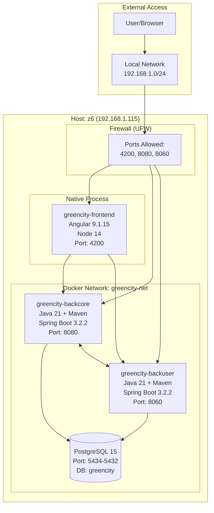
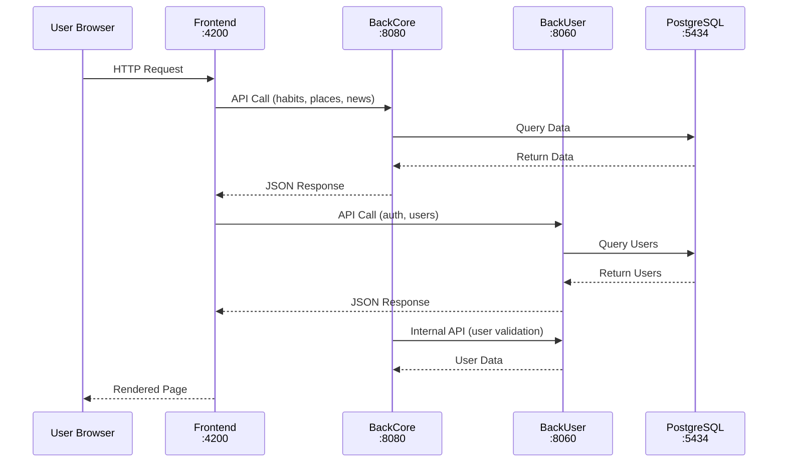
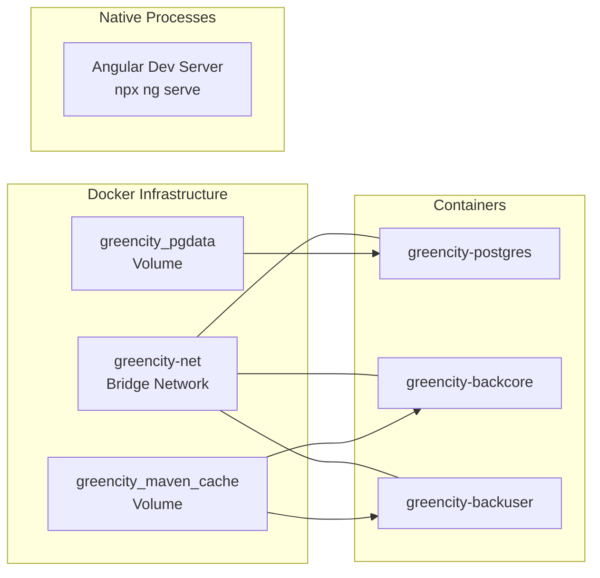
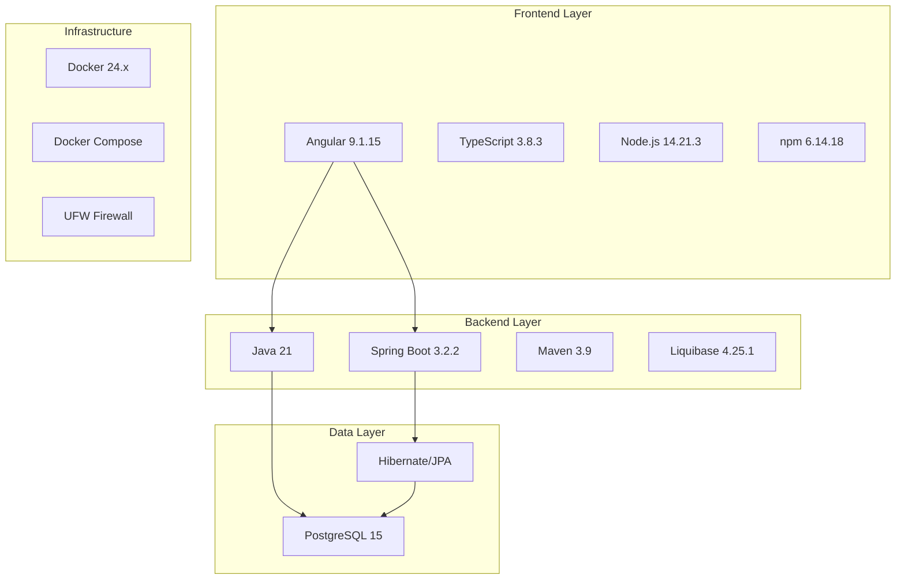

# Task 1: Setup a Webapp - Completion Report

**Project:** GreenCity
**Status:** COMPLETED
**Date:** January 6, 2026
**Environment:** z6 workstation (192.168.1.115)

---

## Architecture Diagram



## Service Communication Flow



## Infrastructure Topology



## Service Status Summary

| Service | Container/Process | Port | Status | Health |
|---------|-------------------|------|--------|--------|
| PostgreSQL | `greencity-postgres` | 5434->5432 | Running | Healthy |
| BackCore API | `greencity-backcore` | 8080 | Running | Started in 13.2s |
| BackUser API | `greencity-backuser` | 8060 | Running | Started in 7.1s |
| Frontend | Native (npx ng serve) | 4200 | Running | Compiled successfully |

## Access URLs

| Service | Local URL | Network URL |
|---------|-----------|-------------|
| Frontend | http://localhost:4200 | http://192.168.1.115:4200 |
| BackCore API | http://localhost:8080 | http://192.168.1.115:8080 |
| BackCore Swagger | http://localhost:8080/swagger-ui.html | http://192.168.1.115:8080/swagger-ui.html |
| BackUser API | http://localhost:8060 | http://192.168.1.115:8060 |
| BackUser Swagger | http://localhost:8060/swagger-ui.html | http://192.168.1.115:8060/swagger-ui.html |

## Files Created

| File | Purpose |
|------|---------|
| `docker-compose.yml` | Docker infrastructure for PostgreSQL + Java backends |
| UFW rules | Firewall ports 4200, 8060 opened for local network |

## Technology Stack Deployed



## Environment Configuration

**Docker Compose Services:**
- PostgreSQL with health checks
- Java backends with Maven build + Spring profiles
- Shared Maven cache volume for faster rebuilds
- Isolated Docker network (greencity-net)

**Environment Variables Set:**
- Database: `DATASOURCE_URL`, `DATASOURCE_USER`, `DATASOURCE_PASSWORD`
- Profile: `PROFILE=docker`
- Azure Storage: Placeholder values (features disabled)
- Google APIs: Placeholder values (features disabled)
- Email: Placeholder values (features disabled)

## Quick Commands Reference

```bash
# Start all services
cd /home/igor/devops/project-green-city
docker compose up -d

# Start frontend (separate terminal)
source ~/.nvm/nvm.sh && nvm use 14
cd /home/igor/devops/project-green-city/greencity-frontend
npx ng serve --host 0.0.0.0 --port 4200 --disable-host-check

# View logs
docker logs greencity-backcore -f
docker logs greencity-backuser -f
docker logs greencity-postgres -f

# Stop all services
docker compose down

# Restart backends (after code changes)
docker compose restart backcore backuser
```

## Known Limitations (Development Mode)

| Feature | Status | Reason |
|---------|--------|--------|
| Email sending | Disabled | Placeholder credentials |
| Google OAuth | Disabled | Placeholder credentials |
| Azure Storage | Disabled | Placeholder credentials |
| Google Maps | Disabled | Placeholder API key |
| File uploads | Disabled | No storage configured |

## Verification & Health Checks

**Service Status:**

| Service | Port | Expected Response | Status |
|---------|------|-------------------|--------|
| PostgreSQL | 5434 | `pg_isready` accepts connections | OK |
| Backend Core | 8080 | HTTP 302 (redirect to Swagger) | OK |
| Backend User | 8060 | HTTP 302 (redirect to Swagger) | OK |
| Frontend | 4200 | HTTP 200 | OK |

**Quick Health Check Script:**
```bash
#!/bin/bash
# GreenCity Health Check

echo "=== GreenCity Health Check ==="

# Database
docker exec greencity-postgres pg_isready -U greencity -d greencity && echo "PostgreSQL: OK" || echo "PostgreSQL: FAILED"

# Backend Core
curl -s http://localhost:8080/swagger-ui.html -o /dev/null -w "%{http_code}" | grep -q 302 && echo "Backend Core: OK" || echo "Backend Core: FAILED"

# Backend User
curl -s http://localhost:8060/swagger-ui.html -o /dev/null -w "%{http_code}" | grep -q 302 && echo "Backend User: OK" || echo "Backend User: FAILED"

# Frontend
curl -s http://localhost:4200 -o /dev/null -w "%{http_code}" | grep -q 200 && echo "Frontend: OK" || echo "Frontend: FAILED"
```

**Available Test Suites:**

| Component | Test Framework | Command |
|-----------|----------------|---------|
| Backend Core | JUnit 5 + TestContainers | `docker exec greencity-backcore mvn test` |
| Backend User | JUnit 5 + TestContainers | `docker exec greencity-backuser mvn test` |
| Frontend | Karma/Jasmine (if configured) | `cd greencity-frontend && npm test` |

**API Endpoints for Manual Testing:**
- Swagger UI (Core): http://localhost:8080/swagger-ui.html
- Swagger UI (User): http://localhost:8060/swagger-ui.html
- Frontend App: http://localhost:4200

## Lessons Learned

1. **Code Formatter Required:** Maven build fails without running `mvn formatter:format` first
2. **Azure Env Vars Mandatory:** `AZURE_CONNECTION_STRING` required even with placeholders
3. **Shared Database:** Both backends use same PostgreSQL database with Liquibase migrations
4. **Service Dependencies:** BackCore calls BackUser for user validation
5. **Angular CLI:** Must use `npx ng serve` (CLI not globally installed)
