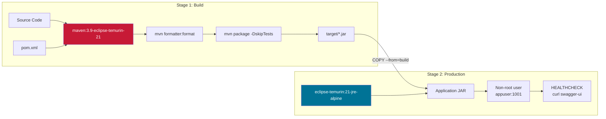
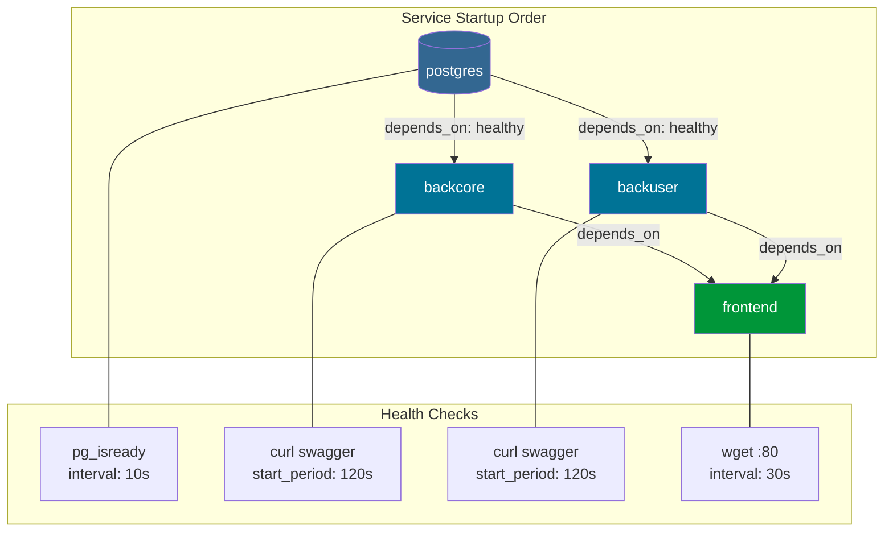
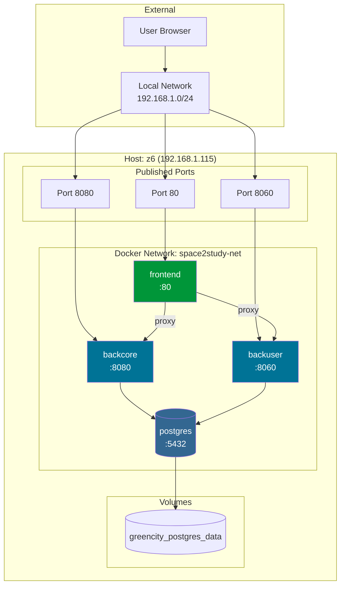
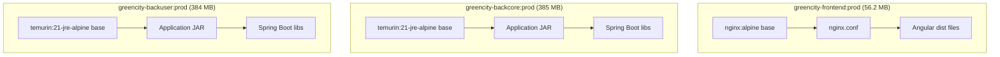

# Task 2: Deploying a Containerized Web Application - Completion Report

**Project:** GreenCity
**Status:** ✅ VERIFIED COMPLETE
**Date:** January 6, 2026 (Verified: January 11, 2026)
**Environment:** z6 workstation (192.168.1.115)

---

## Deliverables Created

| File | Location | Purpose |
|------|----------|---------|
| Dockerfile (backcore) | `greencity-backcore/Dockerfile` | Multi-stage Maven/JRE build |
| Dockerfile (backuser) | `greencity-backuser/Dockerfile` | Multi-stage Maven/JRE build |
| Dockerfile (frontend) | `greencity-frontend/Dockerfile` | Multi-stage Angular/Nginx build |
| nginx.conf | `greencity-frontend/nginx.conf` | API proxy, SPA routing, security |
| .dockerignore (backcore) | `greencity-backcore/.dockerignore` | Exclude dev files |
| .dockerignore (backuser) | `greencity-backuser/.dockerignore` | Exclude dev files |
| .dockerignore (frontend) | `greencity-frontend/.dockerignore` | Exclude dev files |
| docker-compose.prod.yml | `docker-compose.prod.yml` | Production orchestration |
| .env.prod.example | `.env.prod.example` | Environment variable template |

## Production Architecture

```mermaid
graph TB
    subgraph "Docker Compose Production Stack"
        subgraph "Frontend Container"
            NGINX[Nginx:alpine<br/>Port 80]
            ANGULAR[Angular Static Assets<br/>/usr/share/nginx/html]
        end

        subgraph "Backend Core Container"
            CORE[Java 21 JRE Alpine<br/>Port 8080]
            SWAGGER1[/swagger-ui.html]
        end

        subgraph "Backend User Container"
            USER_SVC[Java 21 JRE Alpine<br/>Port 8060]
            SWAGGER2[/swagger-ui.html]
        end

        subgraph "Database Container"
            PG[(PostgreSQL 15<br/>Port 5432)]
            PGVOL[(postgres_data<br/>Volume)]
        end
    end

    BROWSER[User Browser] --> NGINX
    NGINX --> ANGULAR
    NGINX -->|/api/*| CORE
    NGINX -->|/user-api/*| USER_SVC
    NGINX -->|/ownSecurity/*| USER_SVC
    NGINX -->|/googleSecurity/*| USER_SVC
    CORE --> PG
    USER_SVC --> PG
    PG --> PGVOL

    style NGINX fill:#009639,color:#fff
    style CORE fill:#007396,color:#fff
    style USER_SVC fill:#007396,color:#fff
    style PG fill:#336791,color:#fff
```

## Multi-Stage Build Architecture

### Backend Dockerfile (Java Services)



### Frontend Dockerfile (Angular/Nginx)

```mermaid
graph LR
    subgraph "Stage 1: Build"
        NODE[node:14-alpine]
        NPM[npm install]
        BUILD[npm run build-prod]
        DIST[dist/browser/*]
    end

    subgraph "Stage 2: Production"
        NGX[nginx:alpine]
        STATIC[/usr/share/nginx/html]
        CONF[nginx.conf]
        HEALTH[HEALTHCHECK<br/>wget localhost:80]
    end

    NODE --> NPM
    NPM --> BUILD
    BUILD --> DIST
    DIST -->|COPY --from=build| STATIC
    NGX --> STATIC
    CONF --> NGX
    NGX --> HEALTH

    style NODE fill:#339933,color:#fff
    style NGX fill:#009639,color:#fff
```

## Docker Compose Service Dependencies



## Network Topology



## Container Image Layers



## Build Results

| Image | Size | Build Time | Status |
|-------|------|------------|--------|
| greencity-frontend:prod | 56.2 MB | ~60s | ✅ Built & Verified |
| greencity-backcore:prod | 385 MB | ~10-15 min | ✅ Built & Verified |
| greencity-backuser:prod | 384 MB | ~10-15 min | ✅ Built & Verified |

## Production Stack Verification (January 11, 2026)

All containers started and verified healthy:

| Container | Status | Health Check |
|-----------|--------|--------------|
| greencity-frontend | Up (healthy) | HTTP 200 on port 80 |
| greencity-backcore | Up (healthy) | HTTP 302 → Swagger UI |
| greencity-backuser | Up (healthy) | HTTP 302 → Swagger UI |
| greencity-postgres | Up (healthy) | pg_isready |

```bash
# Verification performed:
curl -s -o /dev/null -w "%{http_code}" http://localhost:80     # 200
curl -s -o /dev/null -w "%{http_code}" http://localhost:8080   # 302
curl -s -o /dev/null -w "%{http_code}" http://localhost:8060   # 302
```

## Key Implementation Details

### Backend Dockerfiles (backcore/backuser)
- Multi-stage build (Maven -> JRE)
- Maven formatter plugin execution before build
- Eclipse Temurin 21 JRE Alpine for minimal size
- Non-root user (appuser:1001)
- Health check via Swagger endpoint
- 120s startup period for Spring Boot + Liquibase

### Frontend Dockerfile Features
- Multi-stage build (Node 14 -> Nginx alpine)
- Angular production build (`npm run build-prod`)
- Nginx configuration for SPA routing
- Security headers (X-Frame-Options, etc.)
- Gzip compression enabled
- Health check on port 80

### Nginx Reverse Proxy Configuration

```nginx
# API routes to backend core
location /api/ {
    proxy_pass http://backcore:8080/;
}

# User service routes
location /user-api/ {
    proxy_pass http://backuser:8060/;
}

location /ownSecurity/ {
    proxy_pass http://backuser:8060/ownSecurity/;
}

location /googleSecurity/ {
    proxy_pass http://backuser:8060/googleSecurity/;
}
```

## Issues & Considerations

| Issue | Solution |
|-------|----------|
| Long Java build times (~10-15 min) | Maven dependency caching in multi-stage build |
| Liquibase migrations on startup | 120s health check start period |
| Code formatter requirements | Run `mvn formatter:format` before package |
| Large backend images | Use JRE-only Alpine base image |

## Verification Commands

```bash
# Build production images
docker build -t greencity-frontend:prod ./greencity-frontend
docker build -t greencity-backcore:prod ./greencity-backcore
docker build -t greencity-backuser:prod ./greencity-backuser

# Create .env.prod from template
cp .env.prod.example .env.prod
# Edit .env.prod with actual values

# Run full stack
docker compose -f docker-compose.prod.yml --env-file .env.prod up -d

# Check container status
docker compose -f docker-compose.prod.yml ps

# Check health endpoints
curl http://localhost:80
curl http://localhost:8080/swagger-ui.html
curl http://localhost:8060/swagger-ui.html

# Stop stack
docker compose -f docker-compose.prod.yml down

# Stop and remove volumes (clean restart)
docker compose -f docker-compose.prod.yml down -v
```

## Next Steps

- Task 3: Infrastructure as Code (Terraform/CloudFormation)
- Consider GitHub Actions for automated builds
- Set up container registry for image storage
- Add Prometheus metrics endpoints to backends
