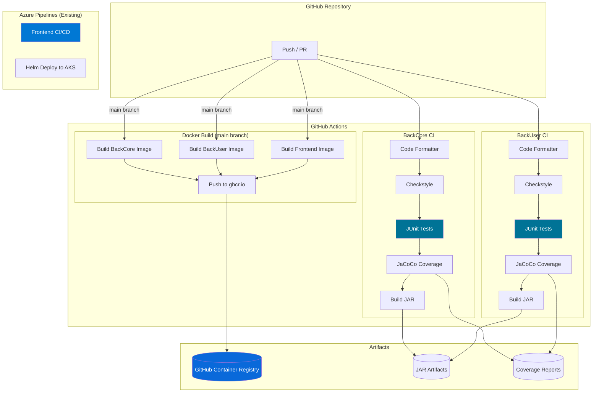

# Task 4: CI/CD Implementation - Completion Report

**Project:** GreenCity
**Status:** IMPLEMENTED
**Date:** January 11, 2026
**Environment:** GitHub Actions + GitHub Container Registry

---

## Deliverables Created

| File | Location | Purpose |
|------|----------|---------|
| BackCore CI workflow | `greencity-backcore/.github/workflows/ci.yml` | Maven build, JUnit tests, JaCoCo coverage |
| BackUser CI workflow | `greencity-backuser/.github/workflows/ci.yml` | Maven build, JUnit tests, JaCoCo coverage |
| Docker build workflow | `.github/workflows/docker.yml` | Build & push all 3 images to ghcr.io |

**Note:** Frontend already has Azure Pipelines CI/CD (kept as-is)

---

## CI/CD Architecture



---

## Workflow Details

### BackCore CI (`greencity-backcore/.github/workflows/ci.yml`)

**Triggers:** Push, Pull Request (all branches)

**Jobs:**
1. **test** - Run tests with PostgreSQL service
   - Checkout code
   - Setup Java 21 (Temurin)
   - Run code formatter (`mvn formatter:format`)
   - Check code style (`mvn checkstyle:check`)
   - Build and test (`mvn clean test`)
   - Generate JaCoCo coverage report
   - Upload coverage artifact

2. **build** - Build JAR artifact (after test passes)
   - Checkout code
   - Setup Java 21
   - Build JAR (`mvn clean package -DskipTests`)
   - Upload JAR artifact

**Services:**
- PostgreSQL 15 with health checks

**Environment Variables:**
```yaml
DATASOURCE_URL: jdbc:postgresql://localhost:5432/greencity
DATASOURCE_USER: greencity
DATASOURCE_PASSWORD: greencity
```

---

### BackUser CI (`greencity-backuser/.github/workflows/ci.yml`)

Same structure as BackCore CI.

---

### Docker Build (`.github/workflows/docker.yml`)

**Triggers:** Push to main/master, Manual dispatch

**Jobs:**
1. **build-backcore** - Build and push backcore image
   - Uses Docker Buildx
   - Pushes to `ghcr.io/<owner>/greencity-backcore`
   - Tags: `latest`, `<git-sha>`

2. **build-backuser** - Build and push backuser image
   - Uses Docker Buildx
   - Pushes to `ghcr.io/<owner>/greencity-backuser`
   - Tags: `latest`, `<git-sha>`

3. **build-frontend** - Build and push frontend image
   - Uses Docker Buildx
   - Pushes to `ghcr.io/<owner>/greencity-frontend`
   - Tags: `latest`, `<git-sha>`

---

## Container Registry

**Registry:** GitHub Container Registry (ghcr.io)

**Images:**
```
ghcr.io/<owner>/greencity-backcore:latest
ghcr.io/<owner>/greencity-backcore:<sha>
ghcr.io/<owner>/greencity-backuser:latest
ghcr.io/<owner>/greencity-backuser:<sha>
ghcr.io/<owner>/greencity-frontend:latest
ghcr.io/<owner>/greencity-frontend:<sha>
```

**Authentication:** Uses built-in `GITHUB_TOKEN`

---

## Build Times

| Component | Estimated Build Time | Notes |
|-----------|---------------------|-------|
| BackCore CI | 10-15 min | Maven + tests |
| BackUser CI | 10-15 min | Maven + tests |
| Docker BackCore | 10-15 min | Multi-stage Maven build |
| Docker BackUser | 10-15 min | Multi-stage Maven build |
| Docker Frontend | ~60s | Angular build |

**Optimization:** Maven dependency caching enabled via `actions/setup-java@v4`

---

## Verification Commands

```bash
# Check workflow files exist
ls -la greencity-backcore/.github/workflows/
ls -la greencity-backuser/.github/workflows/
ls -la .github/workflows/

# Validate YAML syntax
yamllint greencity-backcore/.github/workflows/ci.yml
yamllint greencity-backuser/.github/workflows/ci.yml
yamllint .github/workflows/docker.yml
```

---

## Activation Steps

To activate CI/CD pipelines:

1. **Push workflows to GitHub:**
   ```bash
   cd greencity-backcore
   git add .github/workflows/ci.yml
   git commit -m "Add CI workflow"
   git push

   cd ../greencity-backuser
   git add .github/workflows/ci.yml
   git commit -m "Add CI workflow"
   git push

   cd ..
   git add .github/workflows/docker.yml
   git commit -m "Add Docker build workflow"
   git push
   ```

2. **Verify on GitHub:**
   - Go to repository → Actions tab
   - Check workflow runs
   - Fix any issues shown in logs

3. **(Optional) Enable branch protection:**
   - Settings → Branches → Add rule
   - Require status checks to pass before merging

---

## Existing CI/CD (Frontend)

The frontend already has Azure Pipelines configured:
- `azure-pipelines.yml` - Dev pipeline
- `azure-pipelines-prod.yml` - Production pipeline

These deploy to Azure Kubernetes Service via Helm charts.

---

## Next Steps

- [ ] Push workflows to GitHub repositories
- [ ] Verify CI workflows pass
- [ ] Verify Docker builds complete
- [ ] Enable branch protection rules
- [ ] (Optional) Add SonarCloud integration
- [ ] (Optional) Create Helm charts for backends
- [ ] Task 5: Load Balancing
