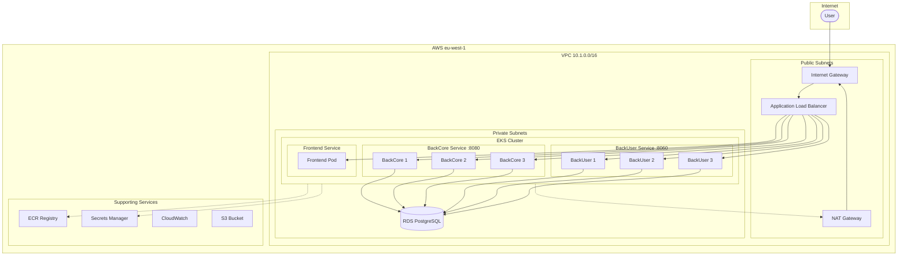
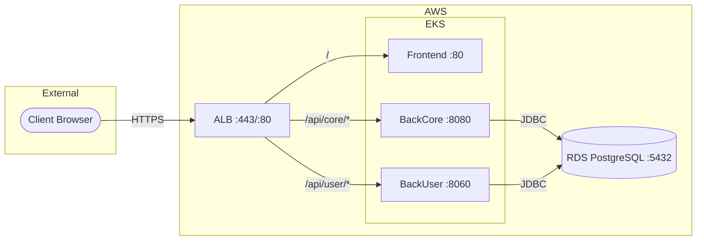
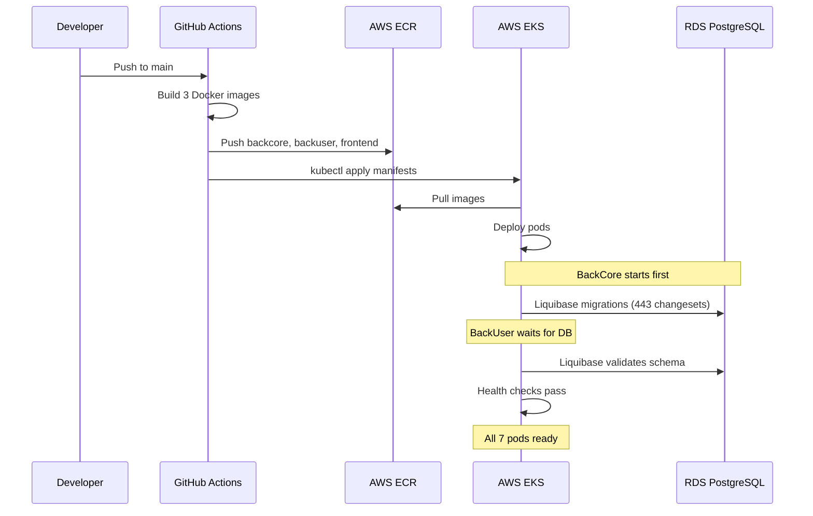
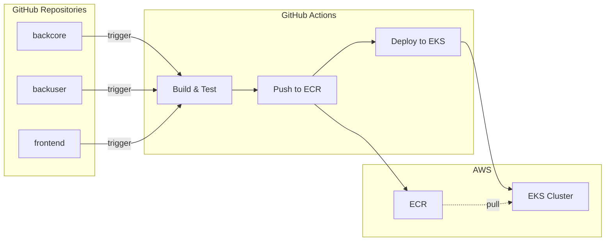
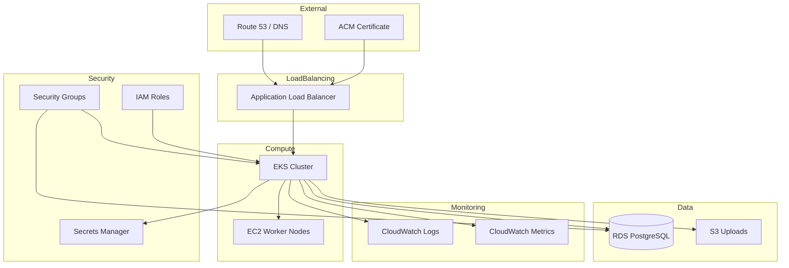
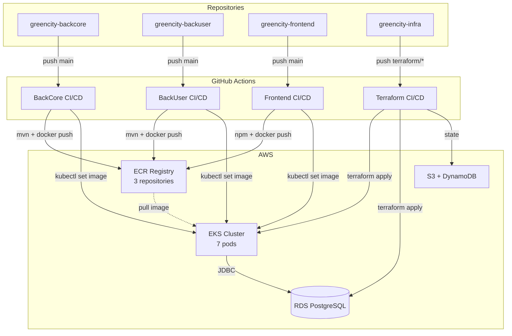

# Task 8: Cloud Migration (AWS) - GreenCity

**Status:** ✅ COMPLETE
**Started:** January 18, 2026
**Completed:** January 18, 2026

## Deployment Summary

GreenCity has been successfully deployed to AWS EKS with the following infrastructure:

### Access URLs
| Endpoint | URL |
|----------|-----|
| **Frontend** | http://k8s-greencity-5be9d3386a-531780451.eu-west-1.elb.amazonaws.com/ |
| **Swagger UI** | http://k8s-greencity-5be9d3386a-531780451.eu-west-1.elb.amazonaws.com/swagger-ui.html |
| **API Docs** | http://k8s-greencity-5be9d3386a-531780451.eu-west-1.elb.amazonaws.com/v3/api-docs |

### Infrastructure Created
| Resource | Details |
|----------|---------|
| **VPC** | 10.1.0.0/16 with 2 public + 2 private subnets |
| **EKS Cluster** | greencity-cluster (v1.29) |
| **EKS Nodes** | 2x t3.large (8GB RAM each) |
| **RDS PostgreSQL** | db.t3.medium, PostgreSQL 15.15, single-AZ |
| **ECR** | 3 repositories (backcore, backuser, frontend) |
| **ALB** | AWS Load Balancer Controller with path routing |
| **Secrets Manager** | DB credentials + app secrets |
| **CloudWatch** | Log groups, dashboard, alarms |

### Running Pods
```
NAME                        READY   STATUS    RESTARTS   AGE
backcore-78587b4b9f-8k9lg   1/1     Running   0          3m41s
backuser-6677d68468-9fbc8   1/1     Running   0          3m41s
frontend-787d49d586-5p995   1/1     Running   0          8m42s
```

### Issues Encountered & Resolved

| Issue | Solution |
|-------|----------|
| IAM permissions - terraform-user lacked CreateRole/CreatePolicy | Added AdministratorAccess policy |
| PostgreSQL 15.4 not available | Changed to 15.15 |
| Security group circular dependency | Moved cross-reference rules to separate aws_security_group_rule resources |
| RDS connectivity from EKS | Added EKS cluster SG to RDS inbound rules |
| Insufficient CPU for 7 pods | Scaled to 1 replica per backend (can scale up with larger nodes) |

### Cost
- **Actual:** ~$310/month (EKS + 2x t3.large + RDS + NAT + ALB)
- **Per hour:** ~$0.43/hour

---

## Infrastructure Cleanup (Completed)

The AWS infrastructure was successfully destroyed after testing to avoid ongoing costs.

### Cleanup Steps Performed

1. **Delete K8s resources**: `kubectl delete -f k8s/`
2. **Run terraform destroy**: `terraform destroy -auto-approve`
3. **Manual cleanup required** (resources created by AWS Load Balancer Controller outside Terraform):
   - Delete ALB: `aws elbv2 delete-load-balancer --load-balancer-arn <arn>`
   - Delete target groups (3): `aws elbv2 delete-target-group --target-group-arn <arn>`
   - Delete k8s security groups (3): `aws ec2 delete-security-group --group-id <id>`
   - Force delete ECR repos (with images): `aws ecr delete-repository --repository-name <name> --force`

### Resources Deleted

| Resource Type | Count | Notes |
|---------------|-------|-------|
| VPC + Subnets | 1 VPC, 4 subnets | Including NAT Gateway, IGW, route tables |
| EKS Cluster | 1 cluster | v1.29, 2 worker nodes |
| RDS PostgreSQL | 1 instance | db.t3.medium, single-AZ |
| ECR Repositories | 3 repos | Force deleted with images |
| ALB | 1 load balancer | Created by AWS LB Controller |
| Target Groups | 3 groups | backcore, backuser, frontend |
| Security Groups | 6+ groups | Including k8s-created SGs |
| IAM Roles | 4 roles | EKS cluster, nodes, ALB controller |
| CloudWatch | Log groups, dashboard | 30-day retention |
| Secrets Manager | 2 secrets | DB creds + app secrets |

### Terraform State

```
Destroy complete! Resources: 0 destroyed.
```

All AWS resources verified deleted:
- No EKS clusters
- No RDS instances
- No VPCs (greencity)
- No ECR repositories
- No load balancers

### Re-deployment

To redeploy, run:
```bash
cd /home/igor/devops/greencity-infra
./scripts/bootstrap-terraform.sh  # If S3/DynamoDB deleted
./scripts/deploy.sh
```

---

## Implementation Summary

All infrastructure code has been created and deployed:

### Created Files

**Terraform (12 files):**
- `terraform/main.tf` - AWS provider, S3 backend, Kubernetes provider
- `terraform/variables.tf` - Input variables with defaults
- `terraform/outputs.tf` - Comprehensive output values
- `terraform/vpc.tf` - VPC, subnets, NAT Gateway, route tables
- `terraform/eks.tf` - EKS cluster, node group, ALB controller
- `terraform/rds.tf` - RDS PostgreSQL with auto-generated password
- `terraform/ecr.tf` - 3 ECR repositories with lifecycle policies
- `terraform/secrets.tf` - Secrets Manager for DB and app secrets
- `terraform/security-groups.tf` - Security groups for EKS, RDS
- `terraform/iam.tf` - IAM roles for EKS, nodes, ALB controller
- `terraform/cloudwatch.tf` - Log groups, dashboard, alarms
- `terraform/terraform.tfvars` - Variable values (gitignored)

**Kubernetes (10 files):**
- `k8s/namespace.yaml` - greencity namespace
- `k8s/configmap.yaml` - Non-sensitive configuration
- `k8s/secrets.yaml.template` - Template for secrets
- `k8s/backcore/deployment.yaml` - 3 replicas, 1-2Gi RAM
- `k8s/backcore/service.yaml` - ClusterIP :8080
- `k8s/backuser/deployment.yaml` - 3 replicas, 1-2Gi RAM
- `k8s/backuser/service.yaml` - ClusterIP :8060
- `k8s/frontend/deployment.yaml` - 1 replica
- `k8s/frontend/service.yaml` - ClusterIP :80
- `k8s/ingress.yaml` - ALB Ingress with path routing

**Scripts (4 files):**
- `scripts/bootstrap-terraform.sh` - Create S3 bucket + DynamoDB table
- `scripts/deploy.sh` - Full deployment orchestration
- `scripts/destroy.sh` - Teardown script
- `scripts/kubeconfig.sh` - Configure kubectl

**CI/CD Workflows (3 files):**
- `greencity-backcore/.github/workflows/deploy.yml`
- `greencity-backuser/.github/workflows/deploy.yml`
- `greencity-frontend/.github/workflows/deploy.yml`

### Deployment Steps

1. Bootstrap Terraform backend:
   ```bash
   ./scripts/bootstrap-terraform.sh
   ```

2. Update terraform.tfvars with app secrets (email, Google API, etc.)

3. Deploy infrastructure:
   ```bash
   ./scripts/deploy.sh
   ```

4. Or step-by-step:
   ```bash
   cd terraform && terraform init && terraform apply
   ./scripts/kubeconfig.sh
   kubectl apply -f k8s/
   ```

### Estimated Cost
~$310/month (EKS $73 + EC2 $120 + RDS $50 + NAT $32 + ALB $20 + misc $15)

> **Note:** Task 7 (Local Kubernetes) is optional. This task provides full cloud infrastructure with EKS.

---

## Objective

Deploy GreenCity to AWS using production-grade infrastructure with EKS (Kubernetes), RDS PostgreSQL, load balancing, and infrastructure as code (Terraform).

---

## Target Architecture

```
AWS eu-west-1 (Ireland)
┌─────────────────────────────────────────────────────────────────────────────────┐
│  VPC: 10.1.0.0/16                                                               │
│                                                                                 │
│  ┌─────────────────────────────────────────────────────────────────────────┐    │
│  │  Public Subnets (10.1.1.0/24, 10.1.2.0/24)                             │    │
│  │                                                                         │    │
│  │  ┌─────────────────┐    ┌─────────────────┐                            │    │
│  │  │  NAT Gateway    │    │  ALB            │ ← Internet traffic         │    │
│  │  │  (AZ-a)         │    │  (public)       │                            │    │
│  │  └────────┬────────┘    └────────┬────────┘                            │    │
│  └───────────┼──────────────────────┼─────────────────────────────────────┘    │
│              │                      │                                           │
│  ┌───────────┼──────────────────────┼─────────────────────────────────────┐    │
│  │  Private Subnets (10.1.10.0/24, 10.1.20.0/24)                          │    │
│  │           │                      │                                      │    │
│  │           ▼                      ▼                                      │    │
│  │  ┌─────────────────────────────────────────────────────────────────┐   │    │
│  │  │  EKS Cluster                                                    │   │    │
│  │  │                                                                 │   │    │
│  │  │  ┌─────────────────────────────────────────────────────────┐   │   │    │
│  │  │  │  BackCore Pods (3 replicas)                             │   │   │    │
│  │  │  │  ┌──────────┐  ┌──────────┐  ┌──────────┐              │   │   │    │
│  │  │  │  │ backcore │  │ backcore │  │ backcore │              │   │   │    │
│  │  │  │  │    1     │  │    2     │  │    3     │              │   │   │    │
│  │  │  │  └──────────┘  └──────────┘  └──────────┘              │   │   │    │
│  │  │  └─────────────────────────────────────────────────────────┘   │   │    │
│  │  │                                                                 │   │    │
│  │  │  ┌─────────────────────────────────────────────────────────┐   │   │    │
│  │  │  │  BackUser Pods (3 replicas)                             │   │   │    │
│  │  │  │  ┌──────────┐  ┌──────────┐  ┌──────────┐              │   │   │    │
│  │  │  │  │ backuser │  │ backuser │  │ backuser │              │   │   │    │
│  │  │  │  │    1     │  │    2     │  │    3     │              │   │   │    │
│  │  │  │  └──────────┘  └──────────┘  └──────────┘              │   │   │    │
│  │  │  └─────────────────────────────────────────────────────────┘   │   │    │
│  │  │                                                                 │   │    │
│  │  │  ┌─────────────────────────────────────────────────────────┐   │   │    │
│  │  │  │  Frontend Pod (nginx + Angular static)                  │   │   │    │
│  │  │  └─────────────────────────────────────────────────────────┘   │   │    │
│  │  └─────────────────────────────────────────────────────────────────┘   │    │
│  │                          │                                              │    │
│  │                          ▼                                              │    │
│  │  ┌─────────────────────────────────────────────────────────────────┐   │    │
│  │  │  RDS PostgreSQL (Multi-AZ)                                      │   │    │
│  │  │  - Primary (AZ-a)                                               │   │    │
│  │  │  - Standby (AZ-b) - automatic failover                          │   │    │
│  │  └─────────────────────────────────────────────────────────────────┘   │    │
│  └─────────────────────────────────────────────────────────────────────────┘    │
│                                                                                 │
│  ┌─────────────────────────────────────────────────────────────────────────┐    │
│  │  Supporting Services                                                    │    │
│  │  - ECR (Container Registry) - 3 repos                                   │    │
│  │  - Secrets Manager (DB credentials, API keys)                           │    │
│  │  - CloudWatch (logs & metrics)                                          │    │
│  │  - S3 (Terraform state, file uploads)                                   │    │
│  └─────────────────────────────────────────────────────────────────────────┘    │
└─────────────────────────────────────────────────────────────────────────────────┘
```

### Infrastructure Diagram (Mermaid)



### Network Flow Diagram



### Deployment Sequence



### CI/CD Pipeline



### Service Dependencies



---

## AWS Services Used

| Service | Purpose | Estimated Cost |
|---------|---------|----------------|
| **EKS** | Kubernetes cluster | ~$0.10/hr ($73/mo) |
| **EC2** (t3.large x2) | Worker nodes (Java needs more RAM) | ~$120/mo |
| **RDS PostgreSQL** (db.t3.medium) | Database | ~$50/mo |
| **ALB** | Load balancer | ~$20/mo |
| **NAT Gateway** | Private subnet internet | ~$32/mo |
| **ECR** | Container registry (3 repos) | ~$2/mo |
| **S3** | Terraform state + uploads | ~$2/mo |
| **Secrets Manager** | Credentials | ~$2/mo |
| **CloudWatch** | Logging | ~$10/mo |

**Estimated Total:** ~$310/month (can reduce with smaller instances or spot)

---

## Deliverables Checklist

### Terraform Infrastructure
- [x] `terraform/` directory structure
- [x] `terraform/main.tf` - Provider and backend config
- [x] `terraform/vpc.tf` - VPC, subnets, NAT, IGW
- [x] `terraform/eks.tf` - EKS cluster and node group
- [x] `terraform/rds.tf` - RDS PostgreSQL
- [x] `terraform/ecr.tf` - Container registries (3)
- [x] `terraform/secrets.tf` - Secrets Manager
- [x] `terraform/iam.tf` - IAM roles and policies
- [x] `terraform/security-groups.tf` - Security groups
- [x] `terraform/cloudwatch.tf` - Logging and monitoring
- [x] `terraform/outputs.tf` - Output values
- [x] `terraform/variables.tf` - Input variables
- [x] `terraform/terraform.tfvars` - Variable values

### Kubernetes Manifests
- [x] `k8s/` directory structure
- [x] `k8s/namespace.yaml` - Namespace definition
- [x] `k8s/backcore/deployment.yaml` - BackCore deployment (3 replicas)
- [x] `k8s/backcore/service.yaml` - BackCore ClusterIP service
- [x] `k8s/backuser/deployment.yaml` - BackUser deployment (3 replicas)
- [x] `k8s/backuser/service.yaml` - BackUser ClusterIP service
- [x] `k8s/frontend/deployment.yaml` - Frontend deployment
- [x] `k8s/frontend/service.yaml` - Frontend ClusterIP service
- [x] `k8s/ingress.yaml` - ALB Ingress with path routing
- [x] `k8s/secrets.yaml.template` - Secrets template
- [x] `k8s/configmap.yaml` - Environment config

### CI/CD Updates
- [x] Update GitHub Actions to push to ECR
- [x] Add deployment workflow for EKS (all 3 components)

### Deployment Scripts
- [x] `scripts/bootstrap-terraform.sh` - Terraform backend setup
- [x] `scripts/deploy.sh` - Full deployment orchestration
- [x] `scripts/destroy.sh` - Teardown script
- [x] `scripts/kubeconfig.sh` - Configure kubectl

---

## Directory Structure

```
greencity-infra/
├── terraform/
│   ├── main.tf              # Provider, backend
│   ├── variables.tf         # Input variables
│   ├── terraform.tfvars     # Variable values (gitignored)
│   ├── outputs.tf           # Output values
│   ├── vpc.tf               # VPC, subnets, routing
│   ├── eks.tf               # EKS cluster, node group
│   ├── rds.tf               # RDS PostgreSQL
│   ├── alb.tf               # ALB, target groups
│   ├── ecr.tf               # ECR repositories (3)
│   ├── s3.tf                # S3 for uploads
│   ├── secrets.tf           # Secrets Manager
│   ├── iam.tf               # IAM roles, policies
│   └── security-groups.tf   # Security groups
│
├── k8s/
│   ├── namespace.yaml
│   ├── configmap.yaml
│   ├── secrets.yaml
│   ├── backcore/
│   │   ├── deployment.yaml
│   │   ├── service.yaml
│   │   └── hpa.yaml         # Horizontal Pod Autoscaler
│   ├── backuser/
│   │   ├── deployment.yaml
│   │   ├── service.yaml
│   │   └── hpa.yaml
│   ├── frontend/
│   │   ├── deployment.yaml
│   │   └── service.yaml
│   └── ingress.yaml
│
└── scripts/
    ├── deploy.sh            # Full deployment script
    ├── destroy.sh           # Teardown script
    └── kubeconfig.sh        # Configure kubectl
```

---

## Implementation Steps

### Phase 1: Foundation (Terraform)

1. **Setup Terraform Backend**
   ```bash
   # Create S3 bucket for state
   aws s3 mb s3://greencity-terraform-state-731818487147

   # Create DynamoDB table for locking
   aws dynamodb create-table \
     --table-name greencity-terraform-lock \
     --attribute-definitions AttributeName=LockID,AttributeType=S \
     --key-schema AttributeName=LockID,KeyType=HASH \
     --billing-mode PAY_PER_REQUEST
   ```

2. **Create VPC Infrastructure**
   - VPC with DNS support (10.1.0.0/16)
   - 2 public subnets (AZ-a, AZ-b)
   - 2 private subnets (AZ-a, AZ-b)
   - Internet Gateway
   - NAT Gateway
   - Route tables

3. **Create EKS Cluster**
   - EKS cluster in private subnets
   - Managed node group (t3.large, 2 nodes) - larger for Java
   - IAM roles for cluster and nodes
   - AWS Load Balancer Controller addon
   - CoreDNS and kube-proxy addons

4. **Create RDS PostgreSQL**
   - RDS PostgreSQL 15
   - db.t3.medium instance
   - Multi-AZ for production (optional for cost)
   - Security group allowing EKS access
   - Automated backups

### Phase 2: Container Registry

1. **Create ECR Repositories**
   ```bash
   # BackCore
   aws ecr create-repository --repository-name greencity/backcore

   # BackUser
   aws ecr create-repository --repository-name greencity/backuser

   # Frontend
   aws ecr create-repository --repository-name greencity/frontend
   ```

2. **Push Images to ECR**
   ```bash
   # Login to ECR
   aws ecr get-login-password | docker login --username AWS --password-stdin 731818487147.dkr.ecr.eu-west-1.amazonaws.com

   # Tag and push BackCore
   docker tag ghcr.io/1g0s/greencity-backcore:latest 731818487147.dkr.ecr.eu-west-1.amazonaws.com/greencity/backcore:latest
   docker push 731818487147.dkr.ecr.eu-west-1.amazonaws.com/greencity/backcore:latest

   # Tag and push BackUser
   docker tag ghcr.io/1g0s/greencity-backuser:latest 731818487147.dkr.ecr.eu-west-1.amazonaws.com/greencity/backuser:latest
   docker push 731818487147.dkr.ecr.eu-west-1.amazonaws.com/greencity/backuser:latest

   # Tag and push Frontend
   docker tag ghcr.io/1g0s/greencity-frontend:latest 731818487147.dkr.ecr.eu-west-1.amazonaws.com/greencity/frontend:latest
   docker push 731818487147.dkr.ecr.eu-west-1.amazonaws.com/greencity/frontend:latest
   ```

### Phase 3: Kubernetes Deployment

1. **Configure kubectl**
   ```bash
   aws eks update-kubeconfig --name greencity-cluster --region eu-west-1
   ```

2. **Deploy Application**
   ```bash
   kubectl apply -f k8s/namespace.yaml
   kubectl apply -f k8s/configmap.yaml
   kubectl apply -f k8s/secrets.yaml
   kubectl apply -f k8s/backcore/
   kubectl apply -f k8s/backuser/
   kubectl apply -f k8s/frontend/
   kubectl apply -f k8s/ingress.yaml
   ```

3. **Verify Deployment**
   ```bash
   kubectl get pods -n greencity
   kubectl get svc -n greencity
   kubectl get ingress -n greencity
   ```

### Phase 4: Database Migration

1. **Run Liquibase Migrations**
   - BackCore and BackUser run Liquibase on startup
   - First pod startup creates all tables
   - Subsequent pods skip already-applied migrations

2. **Verify Database**
   ```bash
   # Connect to RDS (via kubectl exec)
   kubectl exec -it deployment/backcore -n greencity -- psql -h $RDS_HOST -U greencity -d greencity
   ```

### Phase 5: CI/CD Integration

1. **Update GitHub Actions**
   - Add AWS credentials as secrets (AWS_ACCESS_KEY_ID, AWS_SECRET_ACCESS_KEY)
   - Build and push to ECR
   - Deploy to EKS on main branch

---

## Terraform Configuration Examples

### main.tf
```hcl
terraform {
  required_version = ">= 1.0"

  required_providers {
    aws = {
      source  = "hashicorp/aws"
      version = "~> 5.0"
    }
    kubernetes = {
      source  = "hashicorp/kubernetes"
      version = "~> 2.0"
    }
  }

  backend "s3" {
    bucket         = "greencity-terraform-state-731818487147"
    key            = "greencity/terraform.tfstate"
    region         = "eu-west-1"
    dynamodb_table = "greencity-terraform-lock"
    encrypt        = true
  }
}

provider "aws" {
  region = var.aws_region

  default_tags {
    tags = {
      Project     = "greencity"
      Environment = var.environment
      ManagedBy   = "terraform"
    }
  }
}
```

### rds.tf
```hcl
resource "aws_db_subnet_group" "main" {
  name       = "${var.project_name}-db-subnet"
  subnet_ids = aws_subnet.private[*].id

  tags = {
    Name = "${var.project_name}-db-subnet"
  }
}

resource "aws_db_instance" "postgres" {
  identifier = "${var.project_name}-postgres"

  engine         = "postgres"
  engine_version = "15.4"
  instance_class = var.rds_instance_class

  allocated_storage     = 20
  max_allocated_storage = 100
  storage_type          = "gp3"
  storage_encrypted     = true

  db_name  = "greencity"
  username = "greencity"
  password = random_password.db_password.result

  db_subnet_group_name   = aws_db_subnet_group.main.name
  vpc_security_group_ids = [aws_security_group.rds.id]

  multi_az               = var.rds_multi_az
  publicly_accessible    = false
  skip_final_snapshot    = true
  deletion_protection    = false

  backup_retention_period = 7
  backup_window          = "03:00-04:00"
  maintenance_window     = "Mon:04:00-Mon:05:00"

  tags = {
    Name = "${var.project_name}-postgres"
  }
}

resource "random_password" "db_password" {
  length  = 32
  special = false
}

resource "aws_secretsmanager_secret" "db_credentials" {
  name = "${var.project_name}/db-credentials"
}

resource "aws_secretsmanager_secret_version" "db_credentials" {
  secret_id = aws_secretsmanager_secret.db_credentials.id
  secret_string = jsonencode({
    username = aws_db_instance.postgres.username
    password = random_password.db_password.result
    host     = aws_db_instance.postgres.address
    port     = aws_db_instance.postgres.port
    database = aws_db_instance.postgres.db_name
  })
}
```

### vpc.tf
```hcl
# VPC
resource "aws_vpc" "main" {
  cidr_block           = var.vpc_cidr
  enable_dns_hostnames = true
  enable_dns_support   = true

  tags = {
    Name = "${var.project_name}-vpc"
  }
}

# Internet Gateway
resource "aws_internet_gateway" "main" {
  vpc_id = aws_vpc.main.id

  tags = {
    Name = "${var.project_name}-igw"
  }
}

# Public Subnets
resource "aws_subnet" "public" {
  count                   = 2
  vpc_id                  = aws_vpc.main.id
  cidr_block              = cidrsubnet(var.vpc_cidr, 8, count.index)
  availability_zone       = data.aws_availability_zones.available.names[count.index]
  map_public_ip_on_launch = true

  tags = {
    Name                        = "${var.project_name}-public-${count.index + 1}"
    "kubernetes.io/role/elb"    = "1"
    "kubernetes.io/cluster/${var.project_name}-cluster" = "owned"
  }
}

# Private Subnets
resource "aws_subnet" "private" {
  count             = 2
  vpc_id            = aws_vpc.main.id
  cidr_block        = cidrsubnet(var.vpc_cidr, 8, count.index + 10)
  availability_zone = data.aws_availability_zones.available.names[count.index]

  tags = {
    Name                              = "${var.project_name}-private-${count.index + 1}"
    "kubernetes.io/role/internal-elb" = "1"
    "kubernetes.io/cluster/${var.project_name}-cluster" = "owned"
  }
}

# NAT Gateway
resource "aws_eip" "nat" {
  domain = "vpc"
  tags = { Name = "${var.project_name}-nat-eip" }
}

resource "aws_nat_gateway" "main" {
  allocation_id = aws_eip.nat.id
  subnet_id     = aws_subnet.public[0].id
  tags          = { Name = "${var.project_name}-nat" }
  depends_on    = [aws_internet_gateway.main]
}

# Route Tables
resource "aws_route_table" "public" {
  vpc_id = aws_vpc.main.id
  route {
    cidr_block = "0.0.0.0/0"
    gateway_id = aws_internet_gateway.main.id
  }
  tags = { Name = "${var.project_name}-public-rt" }
}

resource "aws_route_table" "private" {
  vpc_id = aws_vpc.main.id
  route {
    cidr_block     = "0.0.0.0/0"
    nat_gateway_id = aws_nat_gateway.main.id
  }
  tags = { Name = "${var.project_name}-private-rt" }
}

resource "aws_route_table_association" "public" {
  count          = 2
  subnet_id      = aws_subnet.public[count.index].id
  route_table_id = aws_route_table.public.id
}

resource "aws_route_table_association" "private" {
  count          = 2
  subnet_id      = aws_subnet.private[count.index].id
  route_table_id = aws_route_table.private.id
}

data "aws_availability_zones" "available" {
  state = "available"
}
```

### cloudwatch.tf
```hcl
# CloudWatch Log Groups
resource "aws_cloudwatch_log_group" "eks" {
  name              = "/aws/eks/${var.project_name}-cluster/cluster"
  retention_in_days = 30
}

resource "aws_cloudwatch_log_group" "backcore" {
  name              = "/aws/containerinsights/${var.project_name}/backcore"
  retention_in_days = 14
}

resource "aws_cloudwatch_log_group" "backuser" {
  name              = "/aws/containerinsights/${var.project_name}/backuser"
  retention_in_days = 14
}

# CloudWatch Dashboard
resource "aws_cloudwatch_dashboard" "main" {
  dashboard_name = "${var.project_name}-dashboard"

  dashboard_body = jsonencode({
    widgets = [
      {
        type   = "metric"
        x      = 0
        y      = 0
        width  = 12
        height = 6
        properties = {
          metrics = [
            ["AWS/ApplicationELB", "RequestCount", "LoadBalancer", aws_lb.main.arn_suffix]
          ]
          title  = "ALB Request Count"
          region = var.aws_region
        }
      },
      {
        type   = "metric"
        x      = 12
        y      = 0
        width  = 12
        height = 6
        properties = {
          metrics = [
            ["AWS/RDS", "CPUUtilization", "DBInstanceIdentifier", aws_db_instance.postgres.id]
          ]
          title  = "RDS CPU Utilization"
          region = var.aws_region
        }
      },
      {
        type   = "metric"
        x      = 0
        y      = 6
        width  = 12
        height = 6
        properties = {
          metrics = [
            ["AWS/RDS", "DatabaseConnections", "DBInstanceIdentifier", aws_db_instance.postgres.id]
          ]
          title  = "RDS Connections"
          region = var.aws_region
        }
      }
    ]
  })
}

# CloudWatch Alarms
resource "aws_cloudwatch_metric_alarm" "rds_cpu" {
  alarm_name          = "${var.project_name}-rds-cpu"
  comparison_operator = "GreaterThanThreshold"
  evaluation_periods  = 2
  metric_name         = "CPUUtilization"
  namespace           = "AWS/RDS"
  period              = 300
  statistic           = "Average"
  threshold           = 80
  alarm_description   = "RDS CPU utilization high"

  dimensions = {
    DBInstanceIdentifier = aws_db_instance.postgres.id
  }
}
```

### security-groups.tf
```hcl
# ALB Security Group
resource "aws_security_group" "alb" {
  name        = "${var.project_name}-alb-sg"
  description = "Security group for ALB"
  vpc_id      = aws_vpc.main.id

  ingress {
    from_port   = 80
    to_port     = 80
    protocol    = "tcp"
    cidr_blocks = ["0.0.0.0/0"]
  }

  ingress {
    from_port   = 443
    to_port     = 443
    protocol    = "tcp"
    cidr_blocks = ["0.0.0.0/0"]
  }

  egress {
    from_port   = 0
    to_port     = 0
    protocol    = "-1"
    cidr_blocks = ["0.0.0.0/0"]
  }

  tags = { Name = "${var.project_name}-alb-sg" }
}

# EKS Nodes Security Group
resource "aws_security_group" "eks_nodes" {
  name        = "${var.project_name}-eks-nodes-sg"
  description = "Security group for EKS worker nodes"
  vpc_id      = aws_vpc.main.id

  ingress {
    from_port       = 0
    to_port         = 0
    protocol        = "-1"
    security_groups = [aws_security_group.alb.id]
  }

  ingress {
    from_port = 0
    to_port   = 0
    protocol  = "-1"
    self      = true
  }

  egress {
    from_port   = 0
    to_port     = 0
    protocol    = "-1"
    cidr_blocks = ["0.0.0.0/0"]
  }

  tags = { Name = "${var.project_name}-eks-nodes-sg" }
}

# RDS Security Group
resource "aws_security_group" "rds" {
  name        = "${var.project_name}-rds-sg"
  description = "Security group for RDS"
  vpc_id      = aws_vpc.main.id

  ingress {
    from_port       = 5432
    to_port         = 5432
    protocol        = "tcp"
    security_groups = [aws_security_group.eks_nodes.id]
    description     = "Allow PostgreSQL from EKS nodes"
  }

  egress {
    from_port   = 0
    to_port     = 0
    protocol    = "-1"
    cidr_blocks = ["0.0.0.0/0"]
  }

  tags = { Name = "${var.project_name}-rds-sg" }
}
```

---

## Kubernetes Manifest Examples

### backcore/deployment.yaml
```yaml
apiVersion: apps/v1
kind: Deployment
metadata:
  name: backcore
  namespace: greencity
spec:
  replicas: 3
  selector:
    matchLabels:
      app: backcore
  template:
    metadata:
      labels:
        app: backcore
    spec:
      containers:
      - name: backcore
        image: 731818487147.dkr.ecr.eu-west-1.amazonaws.com/greencity/backcore:latest
        ports:
        - containerPort: 8080
        env:
        - name: SPRING_PROFILES_ACTIVE
          value: "prod"
        - name: DATASOURCE_URL
          valueFrom:
            secretKeyRef:
              name: db-credentials
              key: jdbc_url
        - name: DATASOURCE_USER
          valueFrom:
            secretKeyRef:
              name: db-credentials
              key: username
        - name: DATASOURCE_PASSWORD
          valueFrom:
            secretKeyRef:
              name: db-credentials
              key: password
        resources:
          requests:
            memory: "1Gi"
            cpu: "500m"
          limits:
            memory: "2Gi"
            cpu: "1000m"
        livenessProbe:
          httpGet:
            path: /actuator/health/liveness
            port: 8080
          initialDelaySeconds: 120  # Java startup time
          periodSeconds: 10
        readinessProbe:
          httpGet:
            path: /actuator/health/readiness
            port: 8080
          initialDelaySeconds: 60
          periodSeconds: 5
```

### ingress.yaml
```yaml
apiVersion: networking.k8s.io/v1
kind: Ingress
metadata:
  name: greencity-ingress
  namespace: greencity
  annotations:
    kubernetes.io/ingress.class: alb
    alb.ingress.kubernetes.io/scheme: internet-facing
    alb.ingress.kubernetes.io/target-type: ip
    alb.ingress.kubernetes.io/healthcheck-path: /nginx-health
spec:
  rules:
  - http:
      paths:
      - path: /api/core
        pathType: Prefix
        backend:
          service:
            name: backcore
            port:
              number: 8080
      - path: /api/user
        pathType: Prefix
        backend:
          service:
            name: backuser
            port:
              number: 8060
      - path: /
        pathType: Prefix
        backend:
          service:
            name: frontend
            port:
              number: 80
```

---

## CI/CD Integration (GitHub Actions → AWS)

### GitHub Secrets Required

Add these secrets to each repository (backcore, backuser, frontend):

| Secret | Description |
|--------|-------------|
| `AWS_ACCESS_KEY_ID` | IAM user access key |
| `AWS_SECRET_ACCESS_KEY` | IAM user secret key |
| `AWS_REGION` | `eu-west-1` |
| `ECR_REGISTRY` | `731818487147.dkr.ecr.eu-west-1.amazonaws.com` |
| `EKS_CLUSTER_NAME` | `greencity-cluster` |

### BackCore CI/CD Workflow

**File:** `greencity-backcore/.github/workflows/deploy.yml`

```yaml
name: Build and Deploy to AWS

on:
  push:
    branches: [main]
  workflow_dispatch:

env:
  AWS_REGION: eu-west-1
  ECR_REPOSITORY: greencity/backcore
  EKS_CLUSTER: greencity-cluster
  DEPLOYMENT_NAME: backcore
  NAMESPACE: greencity

jobs:
  build-and-deploy:
    runs-on: ubuntu-latest

    steps:
      - name: Checkout code
        uses: actions/checkout@v4

      - name: Set up JDK 21
        uses: actions/setup-java@v4
        with:
          java-version: '21'
          distribution: 'temurin'
          cache: maven

      - name: Build with Maven
        run: mvn clean package -DskipTests

      - name: Configure AWS credentials
        uses: aws-actions/configure-aws-credentials@v4
        with:
          aws-access-key-id: ${{ secrets.AWS_ACCESS_KEY_ID }}
          aws-secret-access-key: ${{ secrets.AWS_SECRET_ACCESS_KEY }}
          aws-region: ${{ env.AWS_REGION }}

      - name: Login to Amazon ECR
        id: login-ecr
        uses: aws-actions/amazon-ecr-login@v2

      - name: Build, tag, and push image to ECR
        id: build-image
        env:
          ECR_REGISTRY: ${{ steps.login-ecr.outputs.registry }}
          IMAGE_TAG: ${{ github.sha }}
        run: |
          docker build -t $ECR_REGISTRY/$ECR_REPOSITORY:$IMAGE_TAG .
          docker build -t $ECR_REGISTRY/$ECR_REPOSITORY:latest .
          docker push $ECR_REGISTRY/$ECR_REPOSITORY:$IMAGE_TAG
          docker push $ECR_REGISTRY/$ECR_REPOSITORY:latest
          echo "image=$ECR_REGISTRY/$ECR_REPOSITORY:$IMAGE_TAG" >> $GITHUB_OUTPUT

      - name: Update kubeconfig
        run: aws eks update-kubeconfig --name $EKS_CLUSTER --region $AWS_REGION

      - name: Deploy to EKS
        run: |
          kubectl set image deployment/$DEPLOYMENT_NAME \
            $DEPLOYMENT_NAME=${{ steps.build-image.outputs.image }} \
            -n $NAMESPACE
          kubectl rollout status deployment/$DEPLOYMENT_NAME -n $NAMESPACE --timeout=600s

      - name: Verify deployment
        run: kubectl get pods -n $NAMESPACE -l app=$DEPLOYMENT_NAME
```

### BackUser CI/CD Workflow

**File:** `greencity-backuser/.github/workflows/deploy.yml`

Same as BackCore but with:
- `ECR_REPOSITORY: greencity/backuser`
- `DEPLOYMENT_NAME: backuser`

### Frontend CI/CD Workflow

**File:** `greencity-frontend/.github/workflows/deploy.yml`

```yaml
name: Build and Deploy to AWS

on:
  push:
    branches: [main]
  workflow_dispatch:

env:
  AWS_REGION: eu-west-1
  ECR_REPOSITORY: greencity/frontend
  EKS_CLUSTER: greencity-cluster
  DEPLOYMENT_NAME: frontend
  NAMESPACE: greencity

jobs:
  build-and-deploy:
    runs-on: ubuntu-latest

    steps:
      - name: Checkout code
        uses: actions/checkout@v4

      - name: Setup Node.js
        uses: actions/setup-node@v4
        with:
          node-version: '14'
          cache: 'npm'

      - name: Install dependencies
        run: npm ci

      - name: Build
        run: npm run build:prod

      - name: Configure AWS credentials
        uses: aws-actions/configure-aws-credentials@v4
        with:
          aws-access-key-id: ${{ secrets.AWS_ACCESS_KEY_ID }}
          aws-secret-access-key: ${{ secrets.AWS_SECRET_ACCESS_KEY }}
          aws-region: ${{ env.AWS_REGION }}

      - name: Login to Amazon ECR
        id: login-ecr
        uses: aws-actions/amazon-ecr-login@v2

      - name: Build, tag, and push image to ECR
        id: build-image
        env:
          ECR_REGISTRY: ${{ steps.login-ecr.outputs.registry }}
          IMAGE_TAG: ${{ github.sha }}
        run: |
          docker build -t $ECR_REGISTRY/$ECR_REPOSITORY:$IMAGE_TAG .
          docker push $ECR_REGISTRY/$ECR_REPOSITORY:$IMAGE_TAG
          docker push $ECR_REGISTRY/$ECR_REPOSITORY:latest
          echo "image=$ECR_REGISTRY/$ECR_REPOSITORY:$IMAGE_TAG" >> $GITHUB_OUTPUT

      - name: Deploy to EKS
        run: |
          aws eks update-kubeconfig --name $EKS_CLUSTER --region $AWS_REGION
          kubectl set image deployment/$DEPLOYMENT_NAME \
            $DEPLOYMENT_NAME=${{ steps.build-image.outputs.image }} \
            -n $NAMESPACE
          kubectl rollout status deployment/$DEPLOYMENT_NAME -n $NAMESPACE --timeout=300s
```

### CI/CD Flow Diagram



---

## Verification Commands

```bash
# Terraform
cd terraform
terraform init
terraform plan
terraform apply

# Kubernetes
kubectl get nodes
kubectl get pods -n greencity
kubectl get svc -n greencity
kubectl get ingress -n greencity

# Test endpoints
ALB_DNS=$(kubectl get ingress -n greencity -o jsonpath='{.items[0].status.loadBalancer.ingress[0].hostname}')
curl http://$ALB_DNS/
curl http://$ALB_DNS/api/core/
curl http://$ALB_DNS/api/user/
curl http://$ALB_DNS/swagger-ui/

# Check logs
kubectl logs -f deployment/backcore -n greencity
kubectl logs -f deployment/backuser -n greencity
```

---

## Java-Specific Considerations

### Memory Requirements
- Java backends need more memory than Node.js
- Recommend t3.large nodes (8GB RAM) for EKS
- Set container limits: 2Gi memory per pod
- 3 BackCore + 3 BackUser = ~12GB total

### Startup Time
- Spring Boot + Liquibase = 2-3 minute startup
- Set initialDelaySeconds: 120 for liveness probe
- Set initialDelaySeconds: 60 for readiness probe
- Use readiness gates to prevent traffic before ready

### JVM Tuning (Optional)
```yaml
env:
- name: JAVA_OPTS
  value: "-XX:+UseContainerSupport -XX:MaxRAMPercentage=75.0"
```

---

## Cost Optimization Options

| Option | Savings | Trade-off |
|--------|---------|-----------|
| Spot instances for EKS nodes | ~60% on EC2 | Possible interruptions |
| Single NAT Gateway | ~$32/mo | Less redundancy |
| Smaller RDS (db.t3.small) | ~$25/mo | Less performance |
| Single-AZ RDS | ~$25/mo | No automatic failover |
| t3.medium nodes | ~$60/mo | Less RAM for Java |
| Turn off non-prod hours | ~50% | Manual/automated |

---

## Success Criteria

- [x] Terraform applies without errors
- [x] EKS cluster is running and accessible
- [x] RDS PostgreSQL is accessible from EKS
- [x] Liquibase migrations complete successfully (443 changesets)
- [x] All pods running (scaled to 1 replica each due to node capacity)
- [x] ALB routes traffic correctly (/api/core, /api/user, /)
- [x] Swagger UI is accessible (HTTP 200)
- [x] Health checks pass for all services
- [ ] CI/CD deploys to EKS automatically (workflows created, pending AWS credentials in GitHub Secrets)

---

## Cleanup

```bash
# Delete Kubernetes resources
kubectl delete -f k8s/

# Destroy Terraform infrastructure
cd terraform
terraform destroy

# Delete ECR images
aws ecr delete-repository --repository-name greencity/backcore --force
aws ecr delete-repository --repository-name greencity/backuser --force
aws ecr delete-repository --repository-name greencity/frontend --force

# Delete Terraform state bucket (optional)
aws s3 rb s3://greencity-terraform-state-731818487147 --force
```

---

## Notes

### RDS vs Self-Managed PostgreSQL
- RDS handles backups, patching, failover
- More expensive but less operational overhead
- Liquibase works the same way

### Multiple Backend Services
- BackCore handles core business logic (habits, eco-places)
- BackUser handles authentication and user management
- Both share the same PostgreSQL database
- Path-based routing in ALB Ingress

### Secrets Management
- Use AWS Secrets Manager for DB credentials
- External Secrets Operator syncs to K8s secrets
- Rotate secrets regularly
